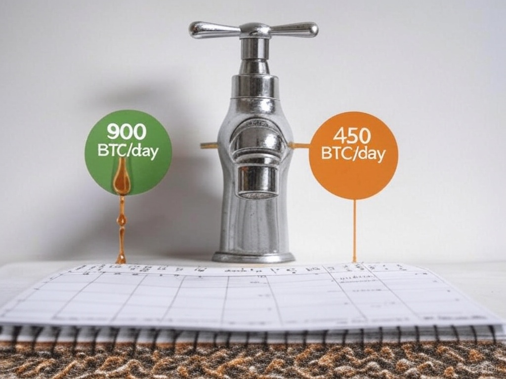

## Introduction

Imagine waking up one day to find your paycheck cut in half—not because you did anything wrong, but because the system you work for was designed that way. On April 19, 2024, that’s exactly what happened to Bitcoin miners across the globe. In an event known as the Bitcoin Halving, their reward for securing the network dropped overnight from 6.25 BTC to 3.125 BTC per block. This wasn’t a glitch or a punishment; it was a milestone baked into Bitcoin’s DNA, the fourth of its kind since the cryptocurrency’s birth in 2009. But what does this mean for Bitcoin, its miners, and the millions watching its price charts? In this article, we’ll break down what Bitcoin halving is, why it exists, and why it’s a big deal—not just for 2024, but for the future of money itself. Welcome to the first stop in our 30-part journey into the 2024 Bitcoin Halving.

## Defining Bitcoin Halving

At its core, Bitcoin halving is a simple idea with massive implications. Every time a miner solves a complex mathematical puzzle to add a new block of transactions to Bitcoin’s blockchain—a digital ledger that records every Bitcoin transaction—they’re rewarded with newly minted bitcoins. This reward, called the block reward, is how new bitcoins enter circulation. But here’s the catch: every 210,000 blocks, or roughly every four years, that reward gets slashed in half. That’s the halving.

The 2024 halving happened at block 840,000, mined around 8:09 p.m. ET on April 19 (or early April 20, depending on your time zone). Before that moment, miners earned 6.25 bitcoins per block—worth about\$375,000 at \$60,000 per BTC. Afterward? Just 3.125 BTC, or roughly \$187,500. Think of it like a faucet slowing to a trickle: Bitcoin’s supply grows more gradually with each halving. Since blocks are added every 10 minutes on average, this event isn’t a surprise—it’s a predictable rhythm in Bitcoin’s 16-year history, ticking like clockwork toward a finite limit.

## The Purpose of Halving

So why does Bitcoin do this? The answer lies in its creator’s vision. When Satoshi Nakamoto launched Bitcoin in 2009, they capped its total supply at 21 million coins—a stark contrast to fiat currencies like the dollar, which governments can print at will. Halving is the mechanism that enforces this scarcity. By cutting the block reward every four years, Bitcoin ensures that new coins enter the system more slowly over time, mimicking the way precious resources like gold become harder to mine as reserves dwindle.

This design makes Bitcoin deflationary. Unlike inflation-driven economies where money loses value over time, Bitcoin’s supply growth shrinks, theoretically boosting its value as demand rises. Before the 2024 halving, about 900 new bitcoins were created daily (6.25 BTC x 144 blocks/day). Post-halving, that dropped to around 450 BTC—worth \$27 million daily at \$60,000 per coin. By 2140, when all 21 million bitcoins are mined, issuance will stop entirely, and miners will rely solely on transaction fees. Halving, then, is Bitcoin’s way of balancing miner incentives today with a promise of rarity tomorrow.

## Why It Matters

Bitcoin halving isn’t just a technical tweak—it ripples across the entire ecosystem. For miners, it’s a gut punch. Their revenue gets halved, forcing them to either cut costs, upgrade equipment, or hope Bitcoin’s price rises to offset the loss. In 2024, big players like Marathon Digital and Riot Platforms had been stockpiling cash and coins to weather the storm, while smaller miners faced a tougher road. Some even shut down, unable to compete as electricity and hardware costs outpaced their earnings.

For investors, halving is a siren song. Historically, halvings have sparked price surges—think Bitcoin climbing from \$12 to \$1,000 after 2012, or hitting \$69,000 after 2020. The logic? Less new supply should drive up value if demand holds steady or grows. In 2024, though, things were different. Spot Bitcoin ETFs, approved in January, had already pushed prices to a peak of \$73,000 in March—before the halving. Post-halving, the price hovered around \$63,000-\$64,000, leaving some to wonder if the hype had peaked early. We’ll dig into that later in the series.

For the Bitcoin network itself, halving reinforces its ethos: a decentralized system where no one—not even miners—can override the rules. It’s a stress test of resilience, proving Bitcoin can adapt as rewards shrink. The 2024 halving, with its unique backdrop of institutional adoption and market maturity, might just redefine how we view this event.

## Conclusion

Bitcoin halving is more than a number crunch—it’s a cornerstone of what makes Bitcoin tick. On April 19, 2024, the world watched as the fourth halving cut miner rewards to 3.125 BTC, slowing the flow of new coins and spotlighting Bitcoin’s scarcity. It’s a moment that challenges miners, excites investors, and underscores Satoshi’s vision of a currency beyond central control. In the next article, we’ll peel back the hood to see how halving works—blocks, miners, and all. For now, tell us: Did the 2024 halving live up to the hype in your eyes? Stick with us to find out how this event fits into Bitcoin’s bigger story.
