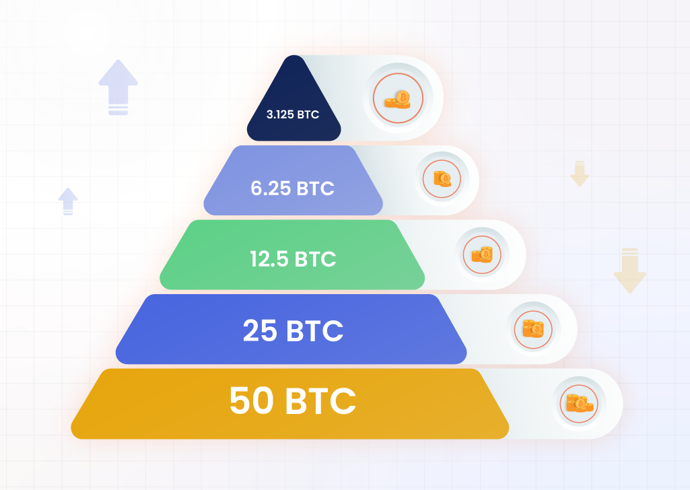

## Introduction

Picture a massive, global machine that churns out new bitcoins every ten minutes—until, every four years, someone flips a switch to slow it down. That’s Bitcoin halving in action, and on April 19, 2024, it happened for the fourth time, cutting miner rewards from 6.25 BTC to 3.125 BTC at block 840,000. In Article 1, we defined what halving is and why it matters: a built-in scarcity mechanism that shapes Bitcoin’s future. But how does this machine actually work? How does the network know when to halve, and what keeps it running smoothly? In this second stop of our 30-part journey, we’ll peel back the hood of Bitcoin’s halving process—exploring blocks, miners, and the clever code that made 2024’s event tick like clockwork. Let’s dive in.

## The Basics: Blocks and Mining

Bitcoin isn’t just digital money—it’s a decentralized network powered by a blockchain, a tamper-proof ledger of every transaction ever made. This ledger grows through blocks, like pages in a book, added roughly every 10 minutes. Miners are the ones writing these pages. Using powerful computers, they race to solve complex math puzzles—a process called proof-of-work. The first miner to crack the puzzle gets to add a new block and claim the block reward: newly minted bitcoins plus transaction fees from users.

Before the 2024 halving, that reward was 6.25 BTC per block. After April 19, it dropped to 3.125 BTC. But here’s the key: this isn’t a random cut. It’s triggered automatically every 210,000 blocks, a milestone hardcoded into Bitcoin’s protocol by Satoshi Nakamoto. At 10 minutes per block, that’s about four years—though the exact timing wobbles slightly due to mining competition. In 2024, block 840,000 arrived right on schedule, mined by ViaBTC at 8:09 p.m. ET, marking the shift. So, how does Bitcoin keep this rhythm?

[Image 1: "Block Counter"]

## Sample Bitcoin Block Output

Here is an example of a Bitcoin block output:

```json
{
  "hash": "0000000000000000000b4d0b6d0b6d0b6d0b6d0b6d0b6d0b6d0b6d0b6d0b6d0b",
  "confirmations": 123456,
  "strippedsize": 123456,
  "size": 123456,
  "weight": 123456,
  "height": 840000,
  "version": 536870912,
  "versionHex": "20000000",
  "merkleroot": "4d0b6d0b6d0b6d0b6d0b6d0b6d0b6d0b6d0b6d0b6d0b6d0b6d0b6d0b6d0b6d0b",
  "tx": [
    "4d0b6d0b6d0b6d0b6d0b6d0b6d0b6d0b6d0b6d0b6d0b6d0b6d0b6d0b6d0b6d0b",
    "6d0b6d0b6d0b6d0b6d0b6d0b6d0b6d0b6d0b6d0b6d0b6d0b6d0b6d0b6d0b6d0b"
  ],
  "time": 1617181920,
  "mediantime": 1617181920,
  "nonce": 2083236893,
  "bits": "1d00ffff",
  "difficulty": 1,
  "chainwork": "0000000000000000000000000000000000000000000000000000000000000002",
  "previousblockhash": "0000000000000000000a4d0b6d0b6d0b6d0b6d0b6d0b6d0b6d0b6d0b6d0b6d0b",
  "nextblockhash": "0000000000000000000c4d0b6d0b6d0b6d0b6d0b6d0b6d0b6d0b6d0b6d0b6d0b"
}
```

## The Trigger: Every 210,000 Blocks

Bitcoin’s halving isn’t controlled by a central authority—it’s a rule baked into the software every Bitcoin node (computer in the network) runs. The magic number is 210,000. When the blockchain hits this block height, the reward halves. It’s that simple. The code checks the block count and adjusts automatically—no human intervention needed.

Why 210,000? Satoshi chose it to space halvings roughly four years apart, balancing miner incentives with Bitcoin’s 21-million-coin cap. At 10 minutes per block, 210,000 blocks equals 1,460 days (4 years, give or take). But it’s not a perfect clock. If miners work faster (more computing power), blocks come quicker; if slower, they lag. In 2024, the network’s hash rate—a measure of total mining power—was sky-high, but Bitcoin’s difficulty adjustment kicked in. Every 2,016 blocks (2 weeks), the puzzle’s difficulty tweaks to keep that 10-minute average steady. That’s why April 19, 2024, wasn’t an exact four-year mark from May 11, 2020—it’s a dance of math and muscle.

## The Adjustment: Difficulty and Stability

Let’s zoom in on that difficulty adjustment—it’s Bitcoin’s unsung hero. Imagine miners as runners in a race where the finish line moves. If too many join (hash rate spikes), the puzzle gets harder; if some drop out, it eases up. This keeps block times near 10 minutes, ensuring halvings stay predictable. In early 2024, miners like Marathon Digital were hashing at 28.7 trillion attempts per second. Yet, the network adjusted, hitting block 840,000 right on cue.

Post-halving, the reward drop to 3.125 BTC didn’t chaos the system. Miners kept mining, difficulty stabilized, and blocks kept coming. Why? Transaction fees. In 2024, fees spiked thanks to ordinals—NFT-like inscriptions on Bitcoin—adding extra income (e.g., ~\$200M in fees by February). This cushion softened the reward cut, showing how Bitcoin adapts as new coins dwindle.


## The Execution: Halving in Action

So, what happened on April 19, 2024? At block 839,999, miners earned 6.25 BTC. At 840,000, ViaBTC mined the halving block—reward: 3.125 BTC. The switch was instant. Every node updated its ledger, miners adjusted their expectations, and the network rolled on. No ceremony, no pause—just code doing its job.

This seamless flip is Bitcoin’s strength. Unlike a bank changing rates, no one can stop or tweak it. The halving’s coded into the consensus rules—if you don’t follow, your blocks get rejected. In 2024, some miners grumbled as profits shrank, but the system didn’t blink. It’s a machine built to last until 2140, when the last bitcoin’s mined.

## Why It Works: Decentralized Precision

Bitcoin halving works because it’s decentralized yet precise. Miners compete globally, nodes verify independently, and difficulty adjusts dynamically—all tied to that 210,000-block trigger. In 2024, despite a mature market and ETF hype, the mechanics held firm. The reward cut didn’t crash the network; it reshaped it. Miners leaned on fees, investors watched prices, and Bitcoin proved its resilience.



## Conclusion

On April 19, 2024, Bitcoin’s halving machine hummed along, dropping the block reward to 3.125 BTC with surgical precision. It’s a process rooted in blocks, mining, and self-adjusting code—a marvel of decentralized design. Now that we’ve seen how it works, next up in Article 3, we’ll explore why Satoshi built it this way, diving into the vision behind Bitcoin’s scarcity. What do you think—does this technical ballet make Bitcoin more intriguing or intimidating? Join us as we uncover its purpose next.
