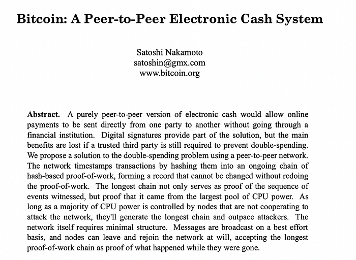
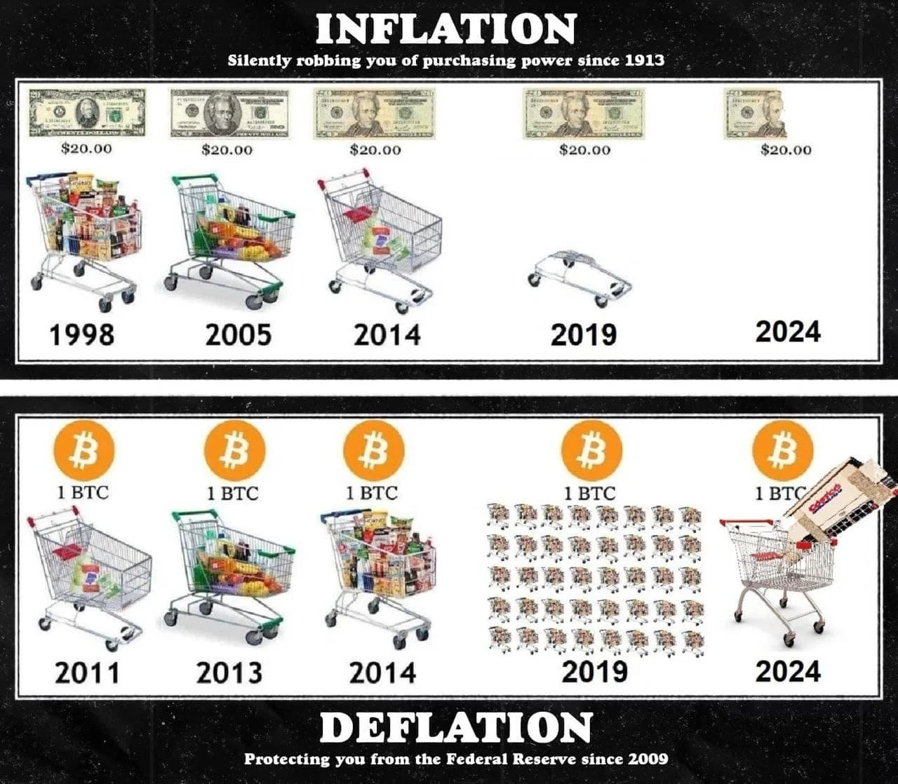
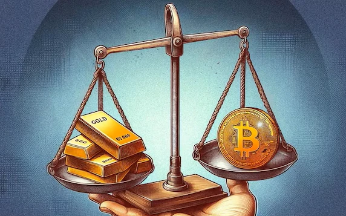

[Banner Image Placeholder: "Satoshi’s Vision Unveiled"]

## Introduction

On April 19, 2024, Bitcoin’s fourth halving slashed miner rewards from 6.25 BTC to 3.125 BTC, slowing the flow of new coins to a trickle—about 450 BTC daily, worth \$27 million at \$60,000 per BTC. We’ve already explored what halving is (Article 1) and how it works (Article 2), but now it’s time to ask: why does Bitcoin halve at all? The answer lies in the mind of its mysterious creator, Satoshi Nakamoto. When Satoshi launched Bitcoin in 2009, they didn’t just build a digital currency—they crafted a new kind of money, one designed to resist inflation and central control. Halving is the heartbeat of that vision, a mechanism to enforce scarcity and mimic the economics of precious metals like gold. In this third stop of our 30-part journey, we’ll uncover why Satoshi chose this path, how halving aligns with Bitcoin’s goals, and what the 2024 event reveals about its enduring design. Let’s step into Satoshi’s world.

## Satoshi’s Whitepaper: A Blueprint for Scarcity

Satoshi Nakamoto’s 2008 whitepaper, Bitcoin: A Peer-to-Peer Electronic Cash System, laid the foundation for everything Bitcoin is today. In it, Satoshi described a currency free from banks and governments, secured by math and decentralization. A key piece of this puzzle was Bitcoin’s fixed supply: only 21 million coins will ever exist. Unlike fiat money—where central banks can print more, devaluing what’s in your wallet—Bitcoin’s supply is capped, and halving ensures it grows slowly.

Satoshi wrote, “The steady addition of a constant amount of new coins is analogous to gold miners expending resources to add gold to circulation.” Halving mimics this real-world scarcity: just as gold gets harder to mine over time, Bitcoin’s new issuance slows every four years. By 2024, with ~19.7 million BTC already mined, halving ensures the remaining ~1.3 million trickle out over decades, until 2140. This isn’t random—it’s a deliberate choice to make Bitcoin a deflationary asset, where value could rise as supply tightens.

## Deflationary Design: Bitcoin vs. Fiat

Let’s break down what “deflationary” means. In most economies, inflation erodes money’s value—think of rising prices for bread or gas. Central banks, like the Federal Reserve, often target 2% annual inflation, printing money to hit that mark. In March 2024, U.S. inflation was 3.5%, eating into savings. Bitcoin flips this script. By halving the block reward every 210,000 blocks, Bitcoin’s issuance rate drops—50 BTC in 2009, down to 3.125 BTC in 2024. This shrinking supply growth means that if demand holds or grows, Bitcoin’s value should, in theory, increase over time.

Satoshi’s goal was to create “digital gold.” Gold’s value comes from its scarcity and mining difficulty; Bitcoin mirrors this with halving. In 2024, the halving cut daily issuance from 900 BTC to 450 BTC—a \$27 million daily reduction at \$60,000 per BTC. Compare that to fiat: in 2020-2022, the U.S. printed trillions, sparking inflation fears. Bitcoin’s halving, by contrast, is a predictable anti-inflation tool, a stark reminder of Satoshi’s distrust of centralized money systems.

## A Balance of Incentives

Halving isn’t just about scarcity—it’s also about keeping Bitcoin’s ecosystem alive. Miners secure the network by solving puzzles, earning block rewards as payment. But if new bitcoins stopped today, would miners keep working? Early on, high rewards (50 BTC in 2009) bootstrapped the network, attracting miners despite Bitcoin’s low value (\$0 initially). As rewards halve, Bitcoin’s price ideally rises to offset the cut, keeping mining profitable.

Satoshi foresaw a future where rewards dwindle, and miners rely on transaction fees. In 2024, this shift was evident: ordinal inscriptions—NFT-like assets on Bitcoin—drove fees to ~\$200M by February, cushioning the halving’s impact. Halving forces miners to adapt, ensuring the network doesn’t rely on endless issuance. It’s a delicate balance: scarcity drives value, but miners must stay incentivized to keep the blockchain secure. So far, 2024 proved Satoshi’s foresight—miners adjusted, and the network hummed along.

## Bitcoin as Digital Gold: A 2024 Perspective

Satoshi’s “digital gold” analogy isn’t just poetic—it’s economic. Gold’s scarcity (e.g., ~200,000 tons mined ever) makes it a store of value. Bitcoin, with its 21 million cap and halving schedule, aims for the same. By 2024, Bitcoin’s narrative as a hedge against inflation gained traction, especially with U.S. inflation at 3.5% and Spot Bitcoin ETFs pulling in \$208M daily pre-halving. Yet, the 2024 halving showed limits: prices didn’t surge immediately, hovering at \$63,000-\$64,000 post-event, down from a \$73,000 peak in March. Does this mean Satoshi’s vision faltered? Not quite—it highlights Bitcoin’s maturing market, where halving effects may take longer to unfold.

## Conclusion

Bitcoin halves because Satoshi Nakamoto envisioned a currency that fights inflation, rewards scarcity, and balances incentives—all while staying free from central control. The 2024 halving, cutting rewards to 3.125 BTC, brought this vision into sharp focus, even if its price impact was muted. Halving isn’t just a technical trick—it’s a philosophy, one that’s shaped Bitcoin into a contender for “digital gold.” Next in Article 4, we’ll zoom out to explore the history of halvings, from 2012 to 2024. What do you think: Is Bitcoin living up to Satoshi’s dream? Stick with us to see how the past informs the future.
