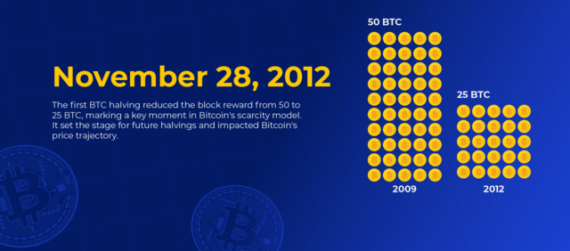
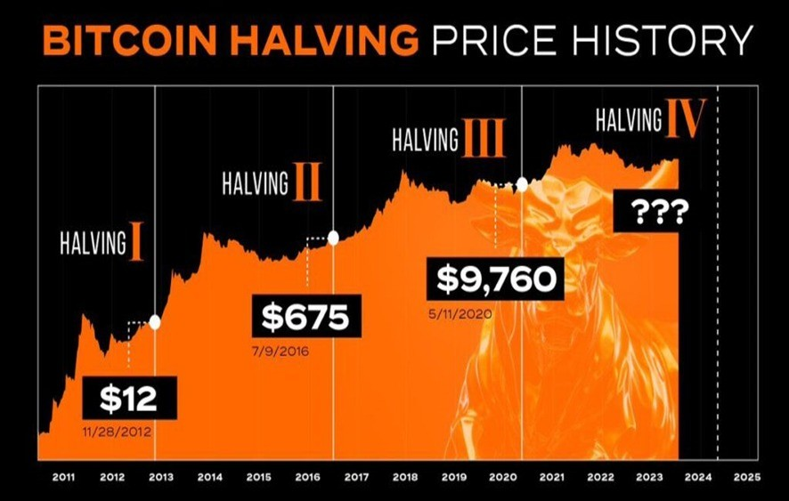
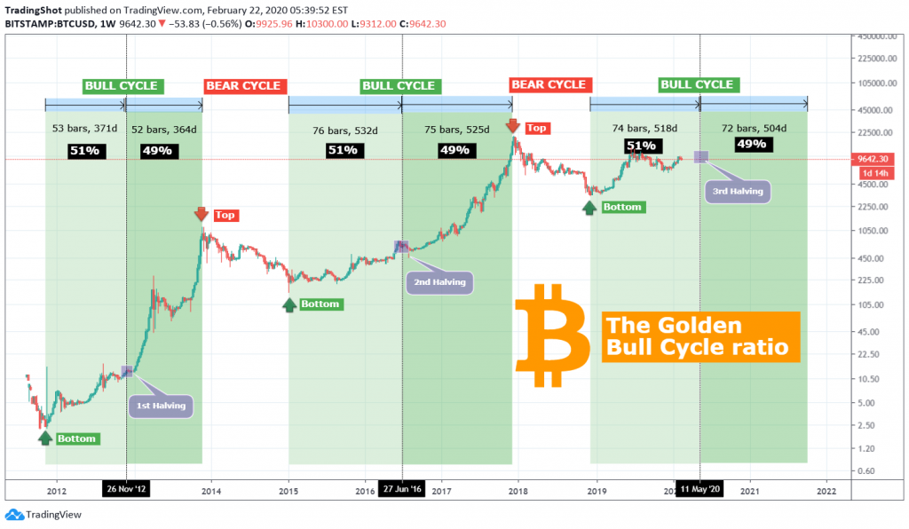

[Banner Image Placeholder: "Halving History Journey"]

## Introduction

Bitcoin’s journey is marked by moments when the clock ticks down and the reward for miners halves—a rhythm set in motion by Satoshi Nakamoto in 2009. From the first halving in 2012 to the latest on April 19, 2024, when the reward dropped from 6.25 BTC to 3.125 BTC at block 840,000, each event has shaped Bitcoin’s identity. We’ve explored what halving is, how it works, and why Satoshi designed it—now, let’s step back and trace the road to 2024. This fourth stop in our 30-part journey takes you through a timeline of Bitcoin’s past halvings, revealing patterns, challenges, and the buildup to this year’s milestone. Ready to walk through history?

## The First Halving: 2012 – Bitcoin’s Infancy

Bitcoin’s first halving hit on November 28, 2012, at block 210,000. Back then, the block reward was 50 BTC—massive compared to today’s 3.125 BTC. Miners, using basic CPUs and GPUs, earned this windfall as Bitcoin’s price hovered around \$12. The network was tiny, with few users and even fewer miners. Halving cut the reward to 25 BTC, a 50% drop that barely dented the system—Bitcoin’s value was so low that mining costs often exceeded profits.

Yet, this halving sparked something. By late 2013, Bitcoin’s price soared past \$1,000, a 8,000% jump. Was it the halving? Not entirely—early adopters, media buzz, and the Silk Road’s rise fueled demand. Still, it showed halving’s potential to tighten supply, setting a precedent for future cycles. The network survived, proving its resilience despite rudimentary tech.

## The Second Halving: 2016 – Growing Pains

Fast forward to July 9, 2016, at block 420,000. The second halving reduced the reward from 25 BTC to 12.5 BTC. By now, Bitcoin was maturing—its price had climbed to ~\$650, and mining shifted to specialized ASIC machines. The halving arrived as the network faced growing pains: transaction backlogs and rising fees hinted at scalability issues.

The aftermath was dramatic. Over the next 18 months, Bitcoin hit \$19,000 in December 2017, a bull run often linked to halving. Supply tightened, demand surged with institutional interest, and speculation ran wild. But the crash to \$3,000 by 2018 showed volatility’s sting. The 2016 halving tested Bitcoin’s ability to handle growth—and while it succeeded short-term, it exposed the need for better infrastructure.

## The Third Halving: 2020 – A Maturing Market

The third halving struck on May 11, 2020, at block 630,000, cutting the reward from 12.5 BTC to 6.25 BTC. Bitcoin’s price was ~\$8,700, and the network boasted a hash rate of over 100 exahashes per second—proof of mining’s industrialization. The COVID-19 pandemic added chaos, with global markets reeling, yet Bitcoin emerged as a “safe haven” narrative took hold.

Post-halving, the price climbed steadily, peaking at \$69,000 in November 2021—a 700% rise over 18 months. Institutional adoption (e.g., Tesla’s \$1.5B BTC purchase) and DeFi growth amplified the effect. Unlike 2016’s crash, the 2020 dip was milder, suggesting a maturing market. The halving reinforced Bitcoin’s scarcity story, with ~18.6 million BTC mined by then, leaving ~2.4 million to go.

## The Road to 2024: Building Momentum

By 2024, Bitcoin had evolved. The fourth halving, on April 19 at block 840,000, reduced the reward to 3.125 BTC. Pre-halving, the price hit \$73,000 in March, driven by Spot Bitcoin ETF approvals in January 2024, which pulled in \$208M daily. Post-halving, it stabilized at \$63,000-\$64,000, a muted reaction compared to past cycles. Why? The market was mature—~19.7 million BTC mined, with ETF demand absorbing sell pressure.

Mining also shifted. Hash rates hit new highs (e.g., Marathon Digital’s 28.7 trillion hashes/second), and ordinal inscriptions boosted fees (~\$200M by February 2024). The road to 2024 wasn’t just about halving—it was about Bitcoin’s integration into finance, tested by inflation (3.5% U.S. CPI in March 2024) and global adoption. Each prior halving laid the groundwork, turning 2024 into a milestone of stability rather than a wild surge.

## Lessons from the Timeline

The halvings tell a story of evolution. In 2012, Bitcoin was an experiment; in 2016, a speculative bubble; in 2020, a maturing asset; and in 2024, a mainstream contender. Each cut (50 → 25 → 12.5 → 6.25 → 3.125 BTC) tightened supply, often sparking price growth within 6-18 months. But external factors—regulation, tech upgrades, and market maturity—shape the outcome. The 2024 halving’s calm suggests Bitcoin’s narrative is shifting from hype to utility.

## Conclusion

From 2012’s humble start to 2024’s poised milestone, Bitcoin’s halvings have carved a path of scarcity and resilience. The April 19, 2024, event—dropping to 3.125 BTC—capped a journey of growth, proving Satoshi’s vision holds even as the market matures. Next in Article 5, we’ll meet the key players driving the 2024 halving. What pattern do you see in this history? Join us to explore who’s shaping Bitcoin’s future.
