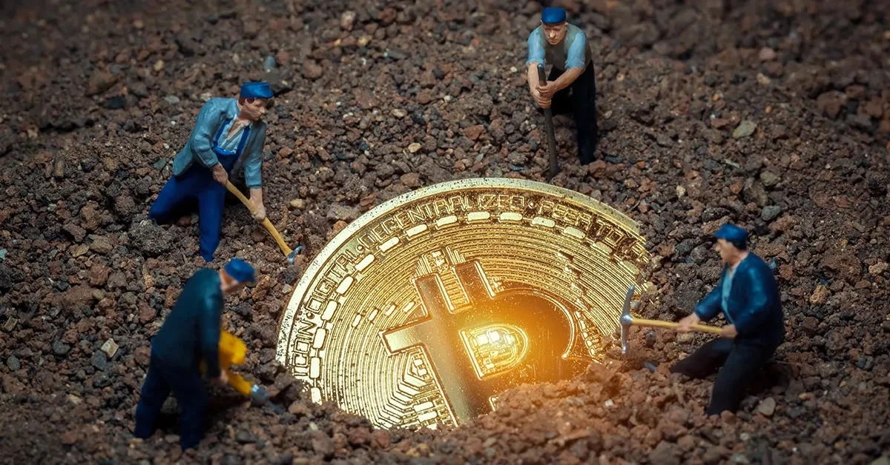
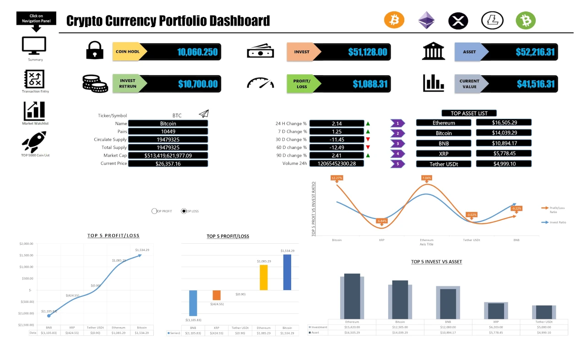

[Banner Image Placeholder: "2024 Halving Players"]

## Introduction

On April 19, 2024, Bitcoin’s fourth halving cut miner rewards from 6.25 BTC to 3.125 BTC at block 840,000, a moment that rippled through the cryptocurrency world. But behind this technical milestone were real players—miners sweating over hardware, investors betting on price moves, and the Bitcoin network itself, humming with code and consensus. We’ve traced halving’s what, how, why, and history—now, let’s meet the cast of characters who drove the 2024 event. In this fifth stop of our 30-part journey, we’ll spotlight the key players, their roles, and how they navigated the halving’s challenges and opportunities. Who’s really behind Bitcoin’s evolution? Let’s find out.

## Miners: The Backbone of Bitcoin

Miners are the muscle of Bitcoin, securing the network by solving complex puzzles to add blocks. In 2024, they faced a seismic shift when the reward halved to 3.125 BTC per block—worth ~\$187,500 at \$60,000 per BTC, down from \$375,000. This cut hit hard, especially for smaller operators. Big players like Marathon Digital and Riot Platforms, with hash rates of 28.7 trillion and 20.4 trillion hashes per second respectively, had prepared by stockpiling cash and BTC reserves. Marathon, for instance, held 26,747 BTC by mid-2024, cushioning the blow.
The halving forced adaptation. Some miners sold pre-halving reserves to cover costs, while others leaned on transaction fees, boosted by ordinal inscriptions (e.g., ~\$200M in fees by February 2024). ViaBTC, which mined block 840,000, exemplified this resilience, thriving amid the shift. Yet, the industry saw consolidation—smaller miners struggled, with energy costs outpacing profits. Miners’ role in 2024 was clear: they kept the network alive, but the halving tested their survival skills.

## Investors: The Market Movers

Investors are the heartbeat of Bitcoin’s price, and the 2024 halving turned their focus to supply and demand. Pre-halving, optimism peaked—Bitcoin hit \$73,000 in March 2024, fueled by Spot Bitcoin ETF approvals in January, which brought \$208M daily inflows. The logic was simple: less new supply (450 BTC/day post-halving vs. 900 BTC/day) should drive prices up if demand held.
Post-halving, the story shifted. Prices stabilized at \$63,000-\$64,000, a muted response compared to past cycles (e.g., 2020’s \$69,000 peak). Institutional investors, like BlackRock with its ETF, absorbed sell pressure, while retail traders debated timing. Some bought the dip, betting on a delayed bull run; others cashed out, wary of inflation (3.5% U.S. CPI in March 2024) and macroeconomic risks. The 2024 halving showed investors as both catalysts and stabilizers, shaping Bitcoin’s value with every trade.

## The Bitcoin Network: The Silent Enforcer

The Bitcoin network itself is a player, a decentralized system enforcing halving without human oversight. Every node—over 15,000 worldwide in 2024—runs the same code, triggering the reward cut at block 840,000. This consensus ensures no one can stop or tweak the halving, a testament to Satoshi’s vision. On April 19, at 8:09 p.m. ET, the network seamlessly adjusted, with difficulty recalibrating every 2,016 blocks to maintain the 10-minute block time.
The network’s strength shone in 2024. Despite a hash rate peak (e.g., 700 exahashes/second), it handled the reward drop without hiccups. Transaction fees, driven by ordinals, provided a buffer, ensuring miners stayed incentivized. The network’s role was quiet but critical—enforcing scarcity, securing transactions, and proving Bitcoin’s resilience as rewards dwindled to 3.125 BTC. It’s the unsung hero of the 2024 halving.

## The 2024 Dynamic: A Team Effort

The 2024 halving wasn’t the work of one player—it was a dance. Miners like Marathon and ViaBTC adapted to lower rewards, investors balanced ETF hype with caution, and the network enforced the rules. The hash rate held strong, fees softened the blow, and prices stabilized despite no immediate surge. This interplay echoed past halvings but reflected a mature ecosystem—less speculative, more strategic.
External factors added complexity. Inflation fears, regulatory shifts, and global adoption (e.g., El Salvador’s BTC use) influenced the players. The 2024 halving showcased a Bitcoin where miners, investors, and the network collaborated to navigate scarcity, setting the stage for future cycles.

## Conclusion

The 2024 halving was a team effort, with miners, investors, and the Bitcoin network each playing a vital role. From Marathon’s reserves to ETF inflows and the network’s seamless switch to 3.125 BTC, April 19, 2024, highlighted their interdependence. This milestone wasn’t just a reward cut—it was a test of Bitcoin’s ecosystem. Next in Article 6, we’ll explore the countdown to 2024 and the hype that built. Who do you think was the biggest influence in 2024? Join us to uncover the buildup.
