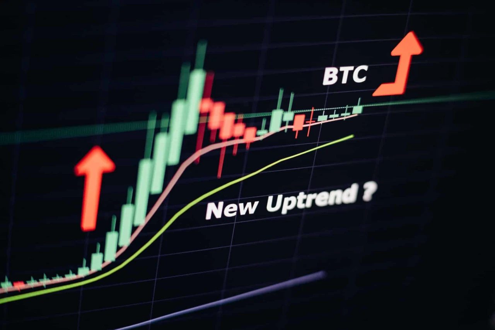
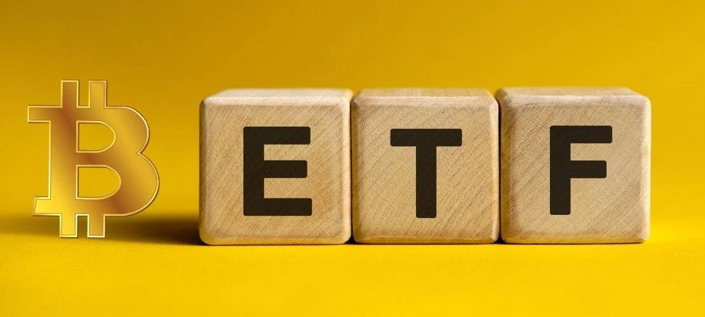
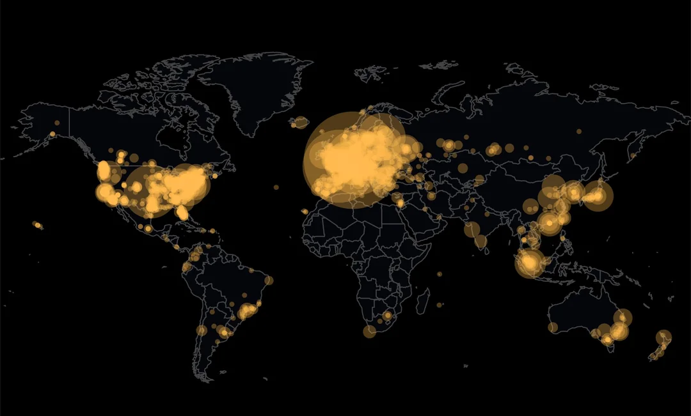

[Banner Image Placeholder: "2024 Halving Countdown Hype"]

## Introduction

As the clock ticked toward April 19, 2024, the Bitcoin community buzzed with anticipation. At block 840,000, the fourth halving would slash miner rewards from 6.25 BTC to 3.125 BTC, a moment many believed would ignite the next bull run. We’ve explored halving’s mechanics, purpose, history, and key players—now, let’s rewind to the months leading up to 2024’s big event. What fueled the excitement? From skyrocketing prices to institutional breakthroughs, the countdown to April 2024 was a whirlwind of speculation, innovation, and global shifts. In this sixth stop of our 30-part journey, we’ll unpack the factors that built the hype, setting the stage for a halving unlike any before. Let’s dive into the frenzy.

## A Price Surge to \$73,000: The Pre-Halving Rally

The road to April 2024 saw Bitcoin’s price soar to an all-time high of \$73,000 in March, up from \$45,000 at the year’s start—a 60% jump in three months. This pre-halving rally wasn’t random. Historically, halvings spark speculation: less new supply (post-halving, 450 BTC/day vs. 900 BTC/day) often drives prices up if demand holds. Investors, remembering 2020’s climb to \$69,000, piled in early, betting on a repeat.
But this rally wasn’t just retail-driven. Institutional money poured in, amplifying the surge. The anticipation of scarcity—only ~1.3 million BTC left to mine by 2024—added fuel. Social media platforms like X buzzed with predictions, with hashtags like #BitcoinHalving trending globally. The rally set a feverish tone, making the halving a must-watch event for crypto enthusiasts.

## Spot Bitcoin ETFs: Institutional FOMO

A game-changer arrived in January 2024: the U.S. SEC approved Spot Bitcoin ETFs, allowing firms like BlackRock and Fidelity to offer Bitcoin exposure to mainstream investors. This wasn’t just a regulatory win—it was a hype machine. By March, ETF inflows hit \$208M daily, absorbing sell pressure and driving demand. For the first time, Wall Street could bet on Bitcoin without touching a wallet, and they did—big time.
The timing couldn’t have been better. With the halving looming, ETFs amplified the narrative: Bitcoin as a scarce asset in a world of inflation (3.5% U.S. CPI in March 2024). Media outlets ran headlines like “Bitcoin ETF Boom Signals Halving Rally,” while X users debated whether institutions would “front-run” the event. The ETFs turned the 2024 halving into a mainstream spectacle, drawing eyes far beyond the crypto bubble.

## Ordinals and Onchain Activity: A Fee Frenzy

While investors speculated, the Bitcoin blockchain itself buzzed with activity. In 2023, ordinals—a protocol for inscribing NFT-like assets onto Bitcoin—exploded in popularity. By February 2024, over 59 million ordinals had been created, driving transaction fees to ~\$200M for miners. This wasn’t just a tech trend; it was a financial lifeline. With the halving set to cut rewards, miners leaned on these fees to offset losses.
The surge in onchain activity fueled hype in another way: it showcased Bitcoin’s utility beyond a store of value. Developers and artists flocked to the network, creating digital collectibles and boosting transaction volumes. On X, posts about ordinals went viral, with users marveling at Bitcoin’s newfound versatility. This buzz added a layer of excitement to the halving, proving the network could evolve while staying true to its roots.

## Global and Macro Context: A Perfect Storm

The 2024 halving didn’t happen in a vacuum. Globally, inflation fears loomed—U.S. CPI hit 3.5% in March, while other nations grappled with currency devaluation. Bitcoin’s “digital gold” narrative gained traction as a hedge, especially in countries like Argentina, where inflation topped 100%. El Salvador’s ongoing Bitcoin adoption, with legal tender status since 2021, also made headlines, showing real-world use.
Meanwhile, regulatory shifts added intrigue. The SEC’s ETF approval signaled a thaw in U.S. policy, but looming regulations—like potential tax hikes on crypto gains—kept investors on edge. On X, sentiment was split: some saw the halving as a catalyst for adoption, others as a regulatory flashpoint. These macro forces turned the April 2024 halving into a global talking point, far beyond past events.

## The Countdown: A Community in Overdrive

As April 19 neared, the crypto community went into overdrive. Blockchain explorers like mempool.space offered live countdowns to block 840,000, while exchanges hosted halving events. Binance, for instance, ran a “Halving Prediction” contest, drawing millions of users. On X, #BitcoinHalving2024 trended for weeks, with influencers like @CryptoBull
predicting \$100,000 by year-end. Even mainstream media, from CNBC to Forbes, covered the event, often citing ETF inflows and ordinals as game-changers.
The hype wasn’t without skepticism. Some on X warned of a “sell-the-news” event, pointing to Bitcoin’s \$73,000 peak as a sign the rally had already happened. Yet, the countdown unified the community—miners, investors, and developers all watched as ViaBTC mined block 840,000 at 8:09 p.m. ET, marking the moment rewards dropped to 3.125 BTC.

## Conclusion

The countdown to April 2024 was a perfect storm of price surges, institutional FOMO, onchain innovation, and global stakes. From \$73,000 highs to ETF mania and ordinals, the hype around the fourth halving was unlike any before, reflecting Bitcoin’s growing maturity. On April 19, the event arrived—not with a price explosion, but with a spotlight on Bitcoin’s evolving role. In Article 7, we’ll dive deeper into the first halving in 2012. What built the most hype for you in 2024? Join us to explore history next.
