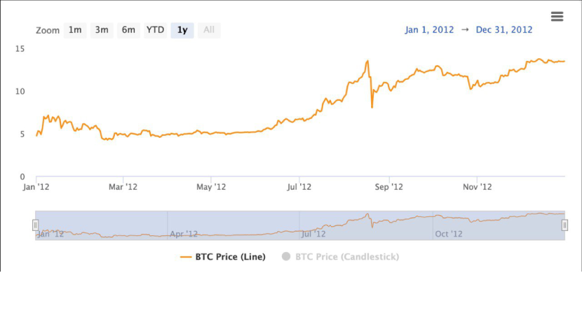

## Introduction

Step back to November 28, 2012—a time when Bitcoin was a quirky experiment, not a global phenomenon. At block 210,000, the first Bitcoin halving cut the block reward from 50 BTC to 25 BTC, a quiet milestone in a network barely three years old. Fast forward to April 19, 2024, when the fourth halving dropped rewards to 3.125 BTC at block 840,000—now a headline event with Bitcoin at \$63,000-\$64,000. We’ve traced halving’s mechanics, purpose, players, and the hype leading to 2024—now, let’s rewind to where it all began. In this seventh stop of our 30-part journey, we’ll explore the 2012 halving, Bitcoin’s infancy, and how it set the stage for today’s milestones. Ready for a trip down memory lane?

## Bitcoin in 2012: A Niche Experiment

In 2012, Bitcoin was a curiosity. Launched by Satoshi Nakamoto in 2009, it had no mainstream traction. The price hovered around \$12, with a market cap under \$140 million—tiny compared to 2024’s \$1.2 trillion. Miners used basic CPUs and GPUs, not the ASIC behemoths of today, and the network processed just a few transactions daily. The community was small, mostly tech enthusiasts and libertarians drawn to Bitcoin’s promise of decentralization.

The first halving, at block 210,000, was almost unnoticed. With 50 BTC rewards, early miners earned a fortune relative to Bitcoin’s value—though electricity costs often outpaced profits. The halving to 25 BTC didn’t disrupt this fragile ecosystem; it was a theoretical shift in a system still finding its footing. Yet, this event marked Bitcoin’s first step toward scarcity, a design choice that would define its future.

## The Halving Event: A Quiet Transition

On November 28, 2012, at 3:34 p.m. UTC, block 210,000 was mined, triggering the halving. No fanfare, no media blitz—just code executing Satoshi’s plan. The reward dropped from 50 BTC to 25 BTC per block, reducing daily issuance from 7,200 BTC to 3,600 BTC. At \$12 per BTC, that was a drop from \$86,400 to \$43,200 daily—significant, but the network adapted.
Mining difficulty was low, and the hash rate was a mere 20 terahashes per second—laughable next to 2024’s 700 exahashes. The transition was smooth; nodes updated automatically, and miners kept going. The halving’s impact was muted by Bitcoin’s obscurity, but it planted a seed: every 210,000 blocks, supply growth would slow, inching toward the 21 million cap.

## The Aftermath: A Slow Burn to \$1,000

The 2012 halving’s immediate effect was subtle. Prices stayed flat through 2013’s early months, with mining profitability a concern. But by late 2013, Bitcoin exploded to over \$1,000—a 8,000\% rise from \$12. Was the halving the cause? Not directly. Early adopters hoarded coins, media coverage grew, and the Silk Road—a dark web marketplace—boosted demand. The halving’s supply cut (now 3,600 BTC/day) aligned with this hype, tightening availability as interest surged.
This slow burn revealed a pattern: halvings don’t guarantee instant riches, but they can amplify existing momentum. The 2012 event showed Bitcoin could survive a reward cut, a resilience echoed in 2024’s stable \$63,000-\$64,000 post-halving price, despite no immediate surge.

## Lessons for 2024: From Infancy to Maturity

The 2012 halving offers lessons for 2024. Back then, Bitcoin was experimental, with minimal infrastructure—compare that to 2024’s 15,000+ nodes and ETF-driven market. The first halving’s modest impact (price growth took a year) contrasts with 2024’s pre-halving \$73,000 peak, driven by institutional FOMO and ordinals (\$200M in fees by February). Yet, both events highlight scarcity’s role: 2012’s 25 BTC reward paved the way for 2024’s 3.125 BTC, with ~19.7 million BTC mined by now.
The 2012 community was tight-knit, relying on forums like Bitcointalk. In 2024, X and media amplified the halving, but the core idea—reward reduction fueling value—remained. The first halving proved Bitcoin’s longevity; 2024 tested its maturity, with miners and investors adapting to a reduced 450 BTC/day issuance.

## Conclusion

The first halving on November 28, 2012, was a quiet dawn for Bitcoin, cutting rewards to 25 BTC and setting a scarcity precedent that led to 2024’s 3.125 BTC milestone. From a niche experiment to a \$1.2 trillion asset, this event showed Bitcoin’s resilience, a theme echoed in the 2024 halving’s stability. It was a foundation stone, proving the network could endure. Next in Article 8, we’ll explore the second halving in 2016. What do you think the 2012 halving taught Bitcoin’s future? Join us to continue the story.
