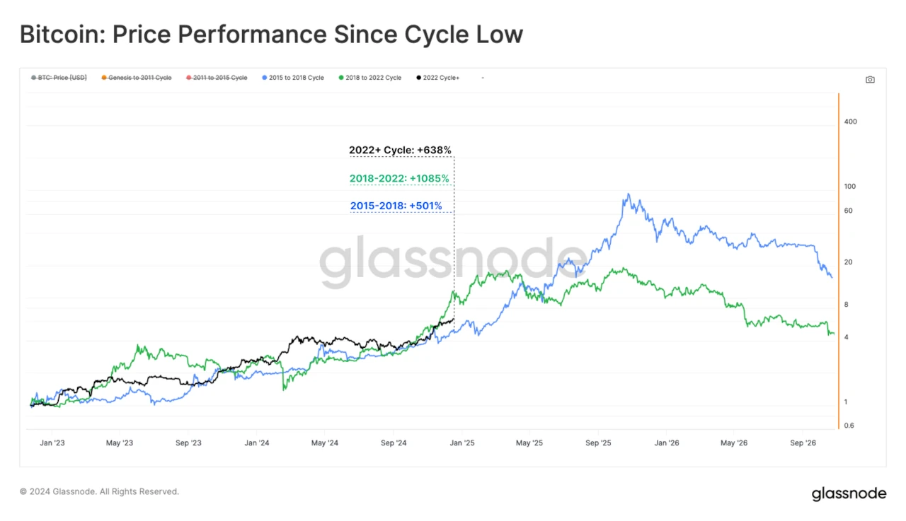

## Introduction

Imagine a young Bitcoin hitting a growth spurt—exciting, but messy. On July 9, 2016, at block 420,000, the second Bitcoin halving cut the block reward from 25 BTC to 12.5 BTC, a pivotal moment as the network strained under rising demand. Fast forward to April 19, 2024, when the fourth halving dropped rewards to 3.125 BTC at block 840,000, with Bitcoin stabilizing at \$63,000-\$64,000—a mature market by comparison. We’ve journeyed through halving’s basics, purpose, history, and the 2012 debut—now, let’s explore 2016’s challenges and triumphs. In this eighth stop of our 30-part journey, we’ll uncover how the second halving tested Bitcoin’s resilience, setting the stage for 2024’s evolution. Let’s dive in.

## Bitcoin in 2016: A Network on the Rise

By 2016, Bitcoin was no longer a niche experiment. Its price had climbed from \$200 in early 2015 to ~\$650 by mid-year, with a market cap nearing \$10 billion. Mining had evolved too—ASIC machines replaced CPUs and GPUs, boosting the hash rate to 1.5 exahashes per second. Transactions grew, hitting 200,000 monthly, as merchants like Overstock began accepting BTC. But this growth brought pains: backlogs clogged the network, with confirmation times stretching to hours, and fees crept up from cents to dollars.

The community was split. Developers debated scalability solutions like SegWit, while users clamored for faster payments. Into this tension came the second halving, a scheduled event that would halve miner rewards and test Bitcoin’s ability to handle stress.

## The Halving Event: A Smooth Cut

On July 9, 2016, at 12:05 a.m. UTC, block 420,000 triggered the halving. The reward dropped from 25 BTC to 12.5 BTC per block, reducing daily issuance from 3,600 BTC to 1,800 BTC. At \$650 per BTC, that was a daily value cut from \$2.34 million to \$1.17 million—a significant shift for miners. Yet, the transition was seamless. The network’s difficulty adjustment, recalibrating every 2,016 blocks, kept the 10-minute block time steady despite rising hash power.

Miners adapted quickly. Larger operations, like Bitmain’s early rigs, absorbed the cut, while smaller players struggled. The halving’s predictability—hardcoded into Bitcoin’s code—ensured stability, a contrast to 2024’s event, where ViaBTC mined block 840,000 with a mature hash rate of 700 exahashes per second. The 2016 halving proved Bitcoin could handle a reward drop, even under strain.

## The Aftermath: A Bull Run and a Crash

The 2016 halving’s aftermath was a rollercoaster. Prices dipped briefly post-event but began climbing by late 2016, hitting \$19,000 in December 2017—a 2,800% rise from \$650. The supply cut to 1,800 BTC/day tightened availability, and demand surged with institutional interest (e.g., CME futures launch in 2017) and retail FOMO. Social media buzzed, with forums like Reddit predicting “to the moon” scenarios.

But the crash came fast. By February 2018, Bitcoin plummeted to \$6,000, then \$3,000 by year-end—a 84% drop from its peak. Overheating speculation, regulatory crackdowns (e.g., China’s ICO ban), and network congestion fueled the fall. The 2016 halving showed that while scarcity could drive growth, external factors and market immaturity could trigger volatility—unlike 2024’s steadier \$63,000-\$64,000 post-halving price, supported by ETFs and fees.

## Lessons for 2024: Maturity vs. Chaos

The 2016 halving offers insights for 2024. Back then, Bitcoin’s growing pains—backlogs, fee hikes—mirrored 2024’s challenges, like miner profitability post-3.125 BTC rewards. But the contexts differ. In 2016, the hash rate was 1.5 exahashes; in 2024, it hit 700 exahashes, with Marathon Digital leading at 28.7 trillion hashes/second. The 2016 crash highlighted speculation’s risks; 2024’s muted response reflects a market tempered by Spot Bitcoin ETF inflows (\$208M/day pre-halving) and ordinal fees (~\$200M by February).

The 2016 halving exposed scalability limits, spurring SegWit adoption. In 2024, ordinals addressed utility, easing the reward cut’s impact. Both events underscore Bitcoin’s adaptability—2016 through chaos, 2024 through maturity. The second halving was a stress test; the fourth, a sign of strength.

## Conclusion

The second halving on July 9, 2016, cut rewards to 12.5 BTC amid Bitcoin’s growing pains, sparking a bull run to \$19,000 and a crash to \$3,000. It tested the network’s resilience, a theme echoed in the 2024 halving’s smooth transition to 3.125 BTC. From chaos to stability, this event shaped Bitcoin’s journey, proving it could evolve under pressure. Next in Article 9, we’ll explore the third halving in 2020. What do you think 2016 taught Bitcoin for 2024? Join us to continue the timeline.
