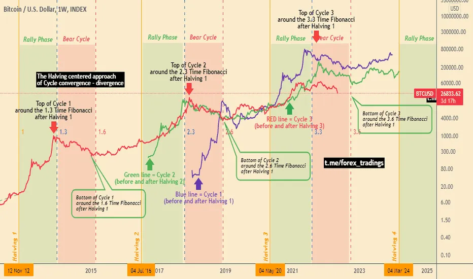
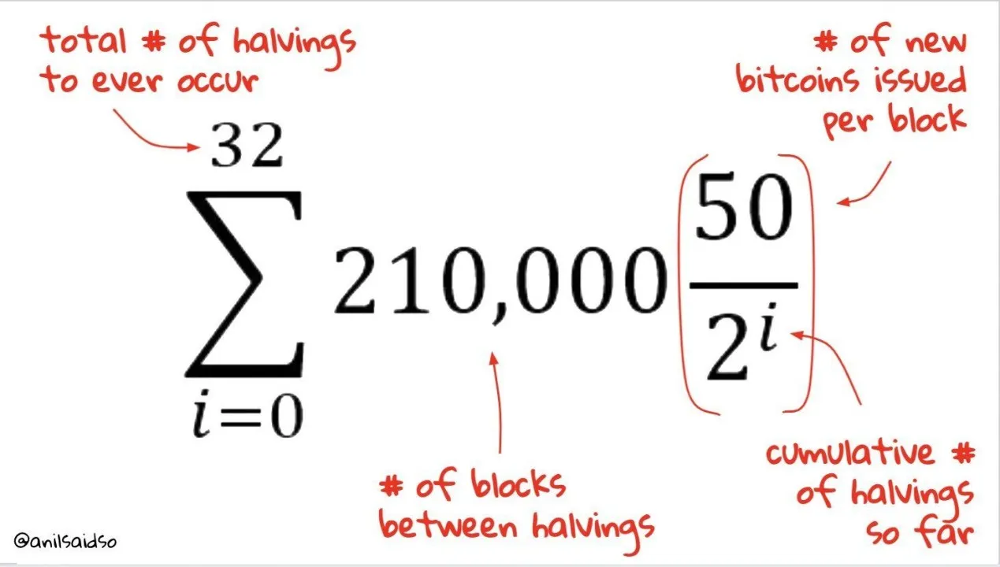

## Introduction

Bitcoin halvings are often hyped as rocket fuel for price surges—less new supply, more demand, right? On April 19, 2024, the fourth halving cut rewards from 6.25 BTC to 3.125 BTC at block 840,000, yet prices stayed steady at \$63,000-\$64,000, down from a \$73,000 peak in March. We’ve explored halving’s mechanics, history, and key events—now, let’s zoom in on price trends. From 2012’s \$1,000 spike to 2020’s \$69,000 peak, past halvings have often led to bull runs, but do they guarantee them? In this tenth stop of our 30-part journey, we’ll analyze historical patterns, the 2024 outcome, and whether halving hype matches reality. Let’s crunch the numbers.

## The 2012 Halving: A Slow Burn to \$1,000

The first halving on November 28, 2012, cut rewards from 50 BTC to 25 BTC. Bitcoin’s price was ~\$12, with a market cap under \$140 million. Post-halving, the price didn’t budge much initially—supply dropped to 3,600 BTC/day, but demand was low. By late 2013, however, Bitcoin surged to over \$1,000—an 8,000% rise over 12 months. Early adopters, media buzz, and the Silk Road’s growth drove demand, while the halving’s supply cut amplified the effect.

The timeline matters: the bull run took a year to materialize, not days. External factors, not just halving, fueled the surge. This slow burn set expectations for future cycles, but 2012’s nascent market—tiny hash rate, few users—makes it a unique case compared to 2024’s mature ecosystem.

## The 2016 Halving: A Wild Ride to \$19,000

The second halving on July 9, 2016, reduced rewards from 25 BTC to 12.5 BTC, with Bitcoin at ~\$650. Supply dropped to 1,800 BTC/day, and prices dipped slightly post-event. But by December 2017, Bitcoin hit \$19,000—a 2,800% rise over 18 months. Institutional interest (e.g., CME futures), retail FOMO, and growing adoption (e.g., merchant acceptance) drove the rally, with halving as a catalyst.

The crash was brutal—down to \$3,000 by late 2018. Volatility defined 2016’s cycle, showing halving’s supply shock can ignite runs but doesn’t shield against corrections. Unlike 2024’s \$63,000-\$64,000 stability post-halving, 2016’s market was speculative, with less infrastructure (e.g., no ETFs) to absorb shocks.

## The 2020 Halving: A Steady Climb to \$69,000

The third halving on May 11, 2020, cut rewards from 12.5 BTC to 6.25 BTC, with Bitcoin at \$8,700. Daily issuance fell to 900 BTC, and prices dipped to \$8,200 before climbing steadily. By November 2021, Bitcoin reached \$69,000—a 700% rise over 18 months. Institutional adoption (e.g., MicroStrategy’s \$425M buy, Tesla’s \$1.5B investment) and the DeFi boom fueled demand, while halving tightened supply.

The dip to \$30,000 in mid-2021 was milder than 2016’s crash, reflecting maturity. The 2020 cycle showed halving’s impact can be steady, not explosive, a pattern 2024 echoed with its post-halving stability, bolstered by ETF inflows (\$208M/day pre-halving).

## The 2024 Halving: A Muted Response

The fourth halving on April 19, 2024, dropped rewards to 3.125 BTC, cutting issuance to 450 BTC/day. Pre-halving, Bitcoin hit \$73,000 in March, driven by Spot Bitcoin ETF approvals in January. Post-halving, prices settled at \$63,000-\$64,000—a 13% drop from the peak, with no immediate bull run. Why? ETF demand absorbed sell pressure, and ordinals fees (~\$200M by February) cushioned miners, reducing urgency to sell.

Unlike past cycles, 2024’s market was mature—~19.7 million BTC mined, institutional players like BlackRock in play, and a hash rate of 700 exahashes/second. The muted response suggests halving effects may now take longer or be less dramatic, shaped by external factors like 3.5% U.S. inflation and global adoption.

## Do Halvings Guarantee Bull Runs?

The pattern is clear: halvings often precede price surges—2012 (12 months to \$1,000), 2016 (18 months to \$19,000), 2020 (18 months to \$69,000). But 2024’s flat response challenges the narrative. Halvings reduce supply, but demand drives price. In 2012-2020, adoption waves (Silk Road, institutions, DeFi) fueled rallies; in 2024, ETF inflows pre-empted the halving, peaking early.

Causation isn’t guaranteed—halvings amplify existing momentum, not create it. Market maturity, macroeconomics (e.g., inflation, regulation), and infrastructure (e.g., fees, ETFs) shape outcomes. The 2024 halving, with no surge by March 2025, suggests investors must temper expectations with reality.

## Conclusion

Bitcoin halvings often spark bull runs, as seen in 2012, 2016, and 2020, but 2024’s steady \$63,000-\$64,000 post-halving price shows they’re no guarantee. Supply cuts set the stage, but demand, maturity, and external forces call the shots. The 2024 halving reflects a market less speculative, more stable—a new chapter. Next in Article 11, we’ll explore how mining evolved across halvings. Do you think halvings still predict price booms? Join us to dive deeper.
