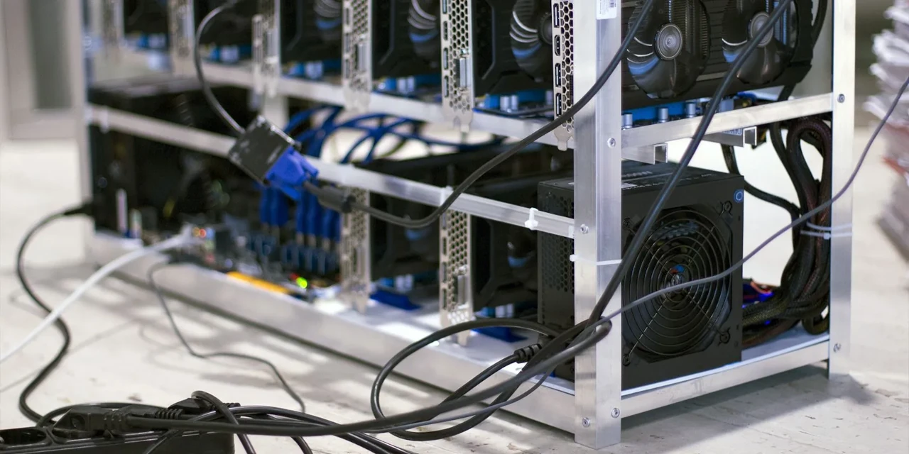
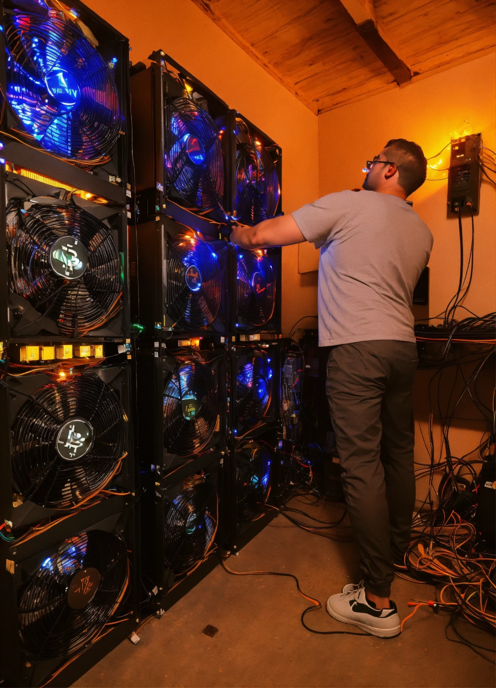

## Introduction

Bitcoin mining has transformed from a garage hobby to a high-stakes industry, shaped by each halving event. On April 19, 2024, the fourth halving cut rewards from 6.25 BTC to 3.125 BTC at block 840,000, challenging miners with a hash rate soaring to 700 exahashes per second. We’ve explored halving’s mechanics, history, players, and price trends—now, let’s dig into how mining has evolved across the 2012, 2016, 2020, and 2024 halvings. In this eleventh stop of our 30-part journey, we’ll trace the technological leaps, economic shifts, and strategic adaptations that have kept miners in the game. Ready to uncover the evolution?

## 2012: The Dawn of DIY Mining

In 2012, Bitcoin mining was a DIY affair. The first halving on November 28 cut rewards from 50 BTC to 25 BTC, with Bitcoin at ~\$12. Miners used CPUs and GPUs, often home computers, to solve puzzles. The hash rate was a modest 20 terahashes per second, and electricity costs frequently outpaced profits. Mining was accessible—anyone with a decent PC could join—but inefficient, with energy use measured in kilowatts, not megawatts.

The halving’s 50% reward cut didn’t disrupt this nascent ecosystem. Early adopters, like those on Bitcointalk, mined for ideology as much as profit. The low difficulty (adjusting every 2,016 blocks) and small network (few transactions) kept it viable. This grassroots phase laid the foundation, but it wouldn’t survive long as Bitcoin grew.

## 2016: The ASIC Revolution

By July 9, 2016, the second halving dropped rewards from 25 BTC to 12.5 BTC, with Bitcoin at ~\$650. Mining had shifted dramatically. ASIC (Application-Specific Integrated Circuit) machines, pioneered by Bitmain, replaced general-purpose hardware, boosting efficiency and hash rate to 1.5 exahashes per second. These specialized rigs consumed more power—kilowatts turned to megawatts—but mined faster, centralizing power among larger operators.

The halving strained smaller miners, who couldn’t afford ASICs or cheap electricity. Consolidation began, with industrial farms in China dominating. Difficulty adjustments kept block times at 10 minutes, but rising fees (from cents to dollars) and transaction backlogs added pressure. The 2016 halving marked mining’s industrialization, a trend that intensified by 2024’s 700 exahashes and Marathon Digital’s 28.7 trillion hashes/second.

## 2020: Scaling Up and Global Spread

The third halving on May 11, 2020, reduced rewards from 12.5 BTC to 6.25 BTC, with Bitcoin at \$8,700. Mining hit a new scale—hash rates exceeded 100 exahashes per second, driven by advanced ASICs and renewable energy adoption (e.g., hydropower in Sichuan). Large players like Riot Platforms emerged, building multi-megawatt facilities, while smaller miners sought niche markets, like Texas’s cheap power.

The halving forced efficiency. Miners optimized cooling, negotiated energy deals, and stockpiled BTC to weather the reward cut. Global spread also grew—North America and Kazakhstan gained share as China cracked down in 2021. The network’s resilience, with fees rising amid COVID-19 demand, cushioned the impact. By 2024, this scalability supported the halving to 3.125 BTC, with ordinals fees (~\$200M by February) adding a new revenue stream.

## 2024: Maturity and Adaptation

The fourth halving on April 19, 2024, brought rewards to 3.125 BTC, with Bitcoin at \$63,000-\$64,000 post-event. Mining had matured into a global industry. The hash rate hit 700 exahashes per second, with Marathon Digital and Riot leading, leveraging AI-optimized rigs and sustainable energy (e.g., 70% renewable by some estimates). ViaBTC’s block 840,000 mine exemplified this precision.

The reward cut challenged profitability—daily issuance fell to 450 BTC (~\$27M at \$60,000/BTC). Big miners raised capital (e.g., Riot’s \$500M debt offering) and sold reserves pre-halving, while smaller operations exited or merged. Ordinals and ETF-driven demand boosted fees and prices, softening the blow. The 2024 halving showcased mining’s adaptability, balancing scarcity with sustainability in a mature market.

## The Evolution in Numbers

Mining’s evolution is stark. In 2012, hash rates were 20 terahashes, energy use was minimal, and rewards were 25 BTC. By 2024, hash rates hit 700 exahashes, energy consumption topped 150 terawatt-hours annually, and rewards fell to 3.125 BTC. Difficulty adjustments grew 10,000-fold since 2012, reflecting computational leaps. Fees, negligible in 2012, hit \$200M in 2024, showing a shift from reward reliance to transaction income.
This progression mirrors Bitcoin’s growth. Early simplicity gave way to industrial scale, then global reach, and now strategic maturity. Each halving forced miners to innovate, a trend 2024’s stability reinforces.

## Conclusion

From 2012’s DIY rigs to 2024’s industrial giants, mining has evolved with each halving—50 BTC to 3.125 BTC, 20 terahashes to 700 exahashes. The April 19, 2024, event tested this maturity, with miners adapting via fees and efficiency. This journey reflects Bitcoin’s resilience and sets the stage for future cycles. Next in Article 12, we’ll synthesize lessons from past halvings for 2024. What’s the biggest mining change you see? Join us to reflect.
