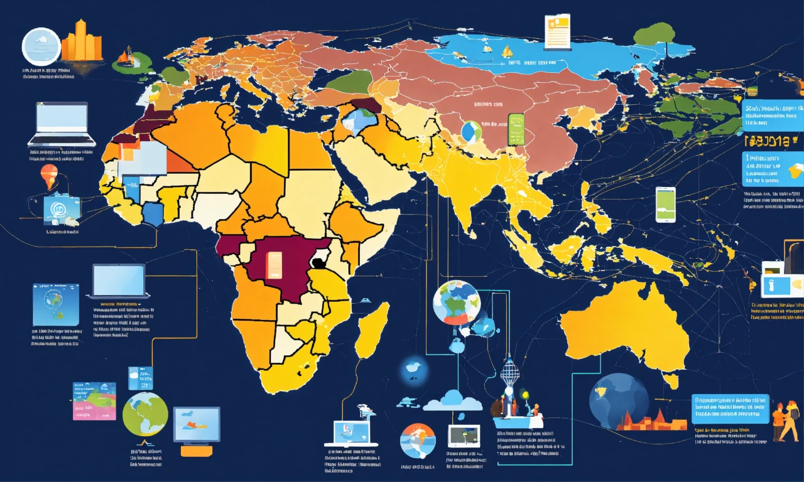

## Introduction

The April 19, 2024, Bitcoin halving—when the block reward dropped from 6.25 BTC to 3.125 BTC at block 840,000—left prices steady at \$63,000-\$64,000, defying the explosive surges of earlier cycles. We’ve journeyed through halving’s fundamentals, historical milestones, key players, price trends, and mining evolution in Section 1—now, it’s time to reflect. In this twelfth stop of our 30-part journey, we’ll extract actionable lessons from the 2012, 2016, and 2020 halvings to shed light on 2024’s unique outcome. What patterns from the past can guide our understanding of this pivotal event? Let’s uncover the wisdom.

## Lesson 1: Halvings Amplify Demand, Not Create It

The 2012 halving, cutting 50 BTC to 25 BTC, sparked a slow climb to \$1,000 (8,000% from \$12) over 12 months, fueled by early adopters and Silk Road demand. The 2016 halving, dropping 25 BTC to 12.5 BTC, drove a \$19,000 peak (2,800% from \$650) in 18 months, boosted by CME futures and retail hype. The 2020 halving, reducing 12.5 BTC to 6.25 BTC, rose to \$69,000 (700% from \$8,700) in 18 months, powered by institutional buys like Tesla’s \$1.5B.

In 2024, the supply cut to 450 BTC/day (from 900) didn’t ignite a run, with prices falling from \$73,000 to \$63,000-\$64,000. Pre-halving ETF inflows (\$208M/day) and ordinal fees (~\$200M by February) had already peaked demand. The lesson? Halvings magnify existing demand—when strong (2012-2020), prices soar; when front-loaded (2024), effects stall or delay.

## Lesson 2: Market Maturity Tames Volatility

In 2012, a \$140M market cap saw wild swings to \$1,000, reflecting its infancy. The 2016 halving hit a \$10B market, peaking at \$19,000 but crashing to \$3,000 due to speculation. The 2020 halving met a \$160B market, climbing steadily to \$69,000 with a mild dip to \$30,000, showing institutional stability.

By 2024, Bitcoin’s \$1.2T market cap and 700 exahashes/second hash rate signaled maturity. The \$63,000-\$64,000 post-halving price, despite a \$73,000 peak, avoided a crash, thanks to ETFs and miner fee buffers. Past halvings taught that as markets grow, volatility softens—a trend 2024 confirmed with its poised response.

## Lesson 3: External Forces Shape the Narrative

External catalysts defined past halvings. In 2012, Silk Road and media buzz drove demand; in 2016, China’s ICO ban triggered a fall; in 2020, COVID-19 and corporate buys (e.g., MicroStrategy’s \$425M) spurred growth. Supply cuts set the stage, but these factors steered the outcome.

For 2024, U.S. inflation (3.5% CPI in March), ETF approvals, and global adoption (e.g., El Salvador’s Chivo wallet) framed the event. The \$73,000 pre-halving peak and stable post-halving price reflect external stability, echoing 2020’s institutional support. The lesson? Halvings are catalysts, but economic and regulatory contexts dictate their economic story.

## Lesson 4: Adaptation Is Key to Survival

Mining evolved with each halving. In 2012, DIY rigs (20 terahashes) weathered 25 BTC; in 2016, ASICs (1.5 exahashes) handled 12.5 BTC amid consolidation; in 2020, industrial scales (100 exahashes) adapted to 6.25 BTC with renewables. The 2024 halving, at 3.125 BTC, saw miners leverage fees (~\$200M from ordinals) and efficiency (700 exahashes).

Past cycles showed adaptation—smaller miners exited, larger ones optimized. In 2024, Marathon Digital’s 26,747 BTC reserves and Riot’s renewable shift mirrored this resilience. The lesson? Survival hinges on flexibility, a trait 2024’s miners mastered.

## Applying Lessons to 2024’s Outcome

The 2024 halving’s \$63,000-\$64,000 stability reflects these lessons. The supply cut amplified pre-existing ETF-driven demand, but maturity tamed volatility, unlike 2016’s crash. External factors—inflation hedging, global adoption—mirrored 2020’s stability, while miners’ fee reliance echoed past adaptation. By March 2025, no surge suggests a delayed or subdued cycle, aligning with a mature market.

The \$73,000 pre-halving peak, absorbed by ETFs, and ordinal fees buffering miners, show 2024 leveraged past patterns. Unlike 2012’s slow burn or 2016’s chaos, 2024’s poised response signals a new phase—growth through utility and stability, not speculation.

## Looking Forward: Implications for 2028

These lessons shape the future. The next halving (2028, 1.5625 BTC) may see further delayed price impacts as markets mature. Mining will lean heavily on fees, with ordinals or similar innovations key. External factors—like regulation or global economics—will remain critical, while adaptation (e.g., sustainable energy) will define survival. The 2024 halving, steady at 3.125 BTC, previews this evolution.

## Conclusion

Lessons from 2012, 2016, and 2020—demand amplification, market maturity, external influence, and adaptation—frame 2024’s \$63,000-\$64,000 post-halving stability. The April 19, 2024, event didn’t guarantee a bull run but showcased a resilient, maturing Bitcoin. Next in Article 13, we’ll dive into its economic impact. Which lesson resonates most with 2024 for you? Join us to explore further.
