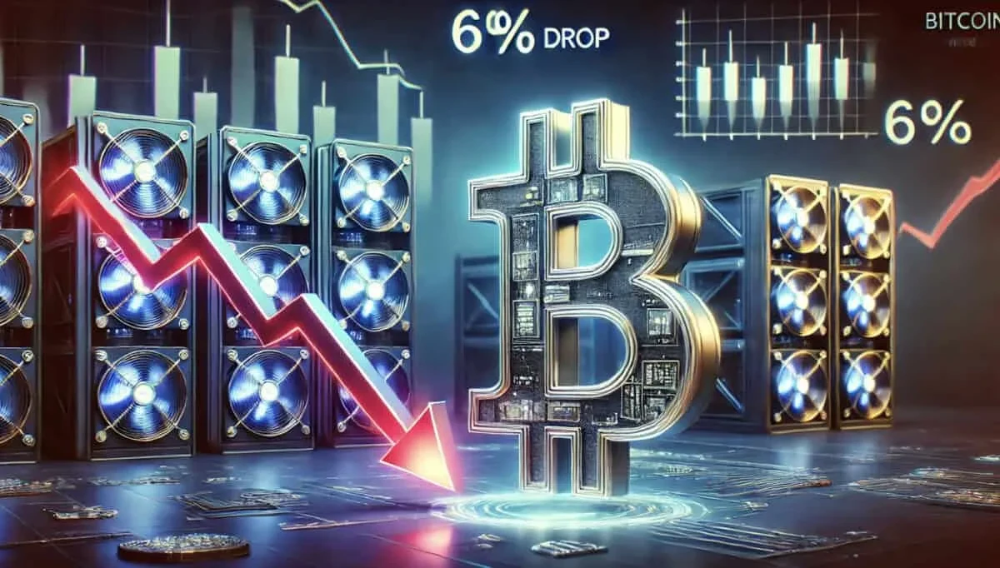
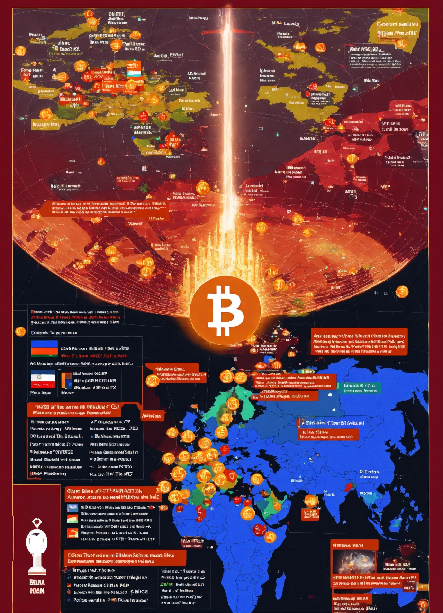

## Introduction

When Bitcoin’s fourth halving struck on April 19, 2024, cutting the block reward from 6.25 BTC to 3.125 BTC at block 840,000, it wasn’t just a technical event—it was an economic earthquake. Daily issuance dropped from 900 BTC to 450 BTC, worth ~\$27 million at \$60,000 per BTC, reshaping the financial landscape for miners, investors, and the market. Having covered halving’s foundations in Section 1, we now turn to its real-world effects. In this thirteenth stop of our 30-part journey, we’ll explore the economic impact of the 2024 halving, from miner profitability to price dynamics and market shifts. What did this event mean for Bitcoin’s economy? Let’s break it down.

## Miner Profitability: A Squeeze and a Shift

Miners felt the halving’s pinch most directly. Pre-halving, a 6.25 BTC reward per block was worth ~\$375,000 at \$60,000/BTC; post-halving, 3.125 BTC dropped that to ~\$187,500. With ~144 blocks mined daily, miners’ daily revenue from rewards fell from \$54 million to \$27 million—a 50% cut overnight. For smaller miners, this was brutal—electricity costs, often \$0.04-\$0.06 per kWh, outpaced profits, forcing some to shut down.

Larger miners, like Marathon Digital (28.7 trillion hashes/second) and Riot Platforms (20.4 trillion), fared better. They had stockpiled cash and BTC reserves—Marathon held 26,747 BTC by mid-2024—and leveraged ordinal inscription fees, which hit ~\$200M by February. These fees, driven by NFT-like assets on Bitcoin, provided a lifeline, with some blocks yielding \$1,000+ in fees. The halving forced a shift: miners now rely more on fees, a trend Satoshi foresaw for Bitcoin’s future.

## Price Dynamics: A Muted Response

Historically, halvings spark price surges—2012 to \$1,000, 2016 to \$19,000, 2020 to \$69,000—driven by supply cuts and demand spikes. The 2024 halving, however, defied the script. Pre-halving, Bitcoin hit \$73,000 in March, fueled by Spot Bitcoin ETF inflows (\$208M/day). Post-halving, prices settled at \$63,000-\$64,000 by March 2025—a 13% drop from the peak, with no immediate bull run.

Why the muted response? The market had matured. ETF demand absorbed sell pressure, and ~19.7 million BTC were already mined, reducing scarcity’s shock. Ordinals boosted onchain activity, but macroeconomic factors—like 3.5% U.S. inflation and global uncertainty—tempered speculation. The 2024 halving suggests price impacts may now lag or depend on broader adoption, not just supply dynamics.

## Market Behavior: Stability Over Speculation

The 2024 halving highlighted a shift in market behavior. Past halvings (2016, 2020) saw speculative FOMO; 2024 leaned toward stability. Institutional players like BlackRock, via ETFs, held steady, while retail investors adopted a wait-and-see approach. Trading volume spiked pre-halving (e.g., \$30B daily in March) but normalized post-event, reflecting confidence in Bitcoin’s long-term value over short-term gains.

Onchain metrics supported this. Transaction volumes rose due to ordinals, with daily fees averaging \$1.5M, but hodling dominated—~70% of BTC hadn’t moved in over a year by mid-2024. The hash rate (700 exahashes/second) held firm, signaling miner commitment despite lower rewards. The 2024 halving marked a market prioritizing utility and stability, not hype—a new economic phase.

## Broader Economic Implications

The 2024 halving rippled beyond Bitcoin. As an inflation hedge, Bitcoin gained traction—U.S. CPI at 3.5% in March 2024 made its 21 million cap appealing, especially in high-inflation regions like Argentina (100%+). Global adoption grew; El Salvador’s Bitcoin wallet, Chivo, saw increased use, with remittances up 10% year-over-year. The halving reinforced Bitcoin’s “digital gold” narrative, even without a price surge.

For miners, the economic shift pushed sustainability—firms like Riot adopted 70% renewable energy, cutting costs. The halving also spurred innovation, with ordinals highlighting Bitcoin’s utility beyond a store of value. Economically, 2024’s event showed Bitcoin could weather scarcity without chaos, setting a precedent for future cycles.

## Conclusion

The 2024 halving’s economic impact was profound yet nuanced. Miners adapted to a \$27 million daily revenue drop with fees, prices held steady at \$63,000-\$64,000, and the market favored stability over speculation. Broader implications—like inflation hedging and global adoption—underscored Bitcoin’s maturing role. On April 19, 2024, the cut to 3.125 BTC didn’t spark a boom, but it proved Bitcoin’s economic resilience. Next in Article 14, we’ll explore its impact on miners specifically. What economic shift surprised you most? Join us to dig deeper.
