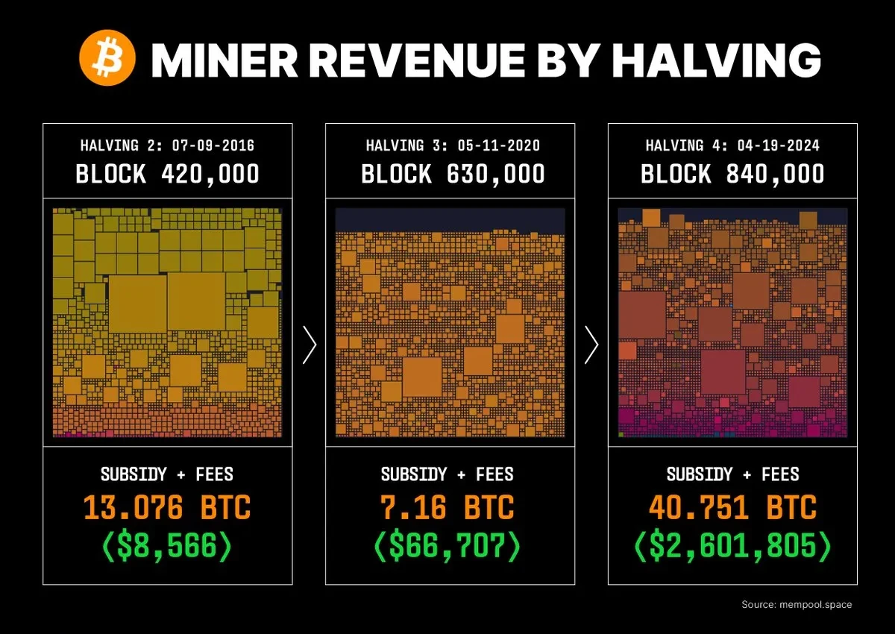

## Introduction

When the fourth Bitcoin halving hit on April 19, 2024, cutting the block reward from 6.25 BTC to 3.125 BTC at block 840,000, miners faced a seismic shift. Daily issuance dropped from 900 BTC to 450 BTC—worth ~\$27 million at \$60,000 per BTC—halving their primary revenue overnight. In Article 13, we explored the broader economic ripple; now, let’s zoom in on the miners, the backbone of Bitcoin’s security. In this fourteenth stop of our 30-part journey, we’ll unpack how the 2024 halving impacted miners’ profitability, operations, and strategies, revealing their resilience in a changing landscape. How did they adapt to this challenge? Let’s dive in.

## The Immediate Revenue Hit

The halving’s most direct impact was a 50% revenue drop. Pre-halving, miners earned ~\$375,000 per block (6.25 BTC at \$60,000/BTC); post-halving, that fell to ~\$187,500 (3.125 BTC). With ~144 blocks daily, total reward revenue plummeted from \$54 million to \$27 million. For small-scale miners—those with a few ASIC rigs and high electricity costs (e.g., \$0.10/kWh)—this was a knockout blow. Many couldn’t cover operational expenses, leading to shutdowns or sales.

Larger players, like Marathon Digital (28.7 trillion hashes/second) and Riot Platforms (20.4 trillion), absorbed the hit better. Marathon, with 26,747 BTC in reserves by mid-2024, and Riot, with a \$500M debt offering, had financial cushions. The immediate impact forced a reckoning: survival hinged on adapting to a leaner reward system.

## Operational Adjustments: Efficiency and Consolidation

Miners responded with operational overhauls. Smaller operators sought cheaper electricity—some relocated to Texas or Kazakhstan, where rates dipped to \$0.03/kWh, cutting costs by 50-70%. Larger firms optimized existing rigs, upgrading to energy-efficient ASICs (e.g., Bitmain’s Antminer S19 XP) and adopting liquid cooling to boost output per watt.

Consolidation accelerated. By mid-2024, reports showed 20% of smaller miners exited, their rigs scooped up by giants like Marathon and CleanSpark. The hash rate, peaking at 700 exahashes/second, remained stable, as big players absorbed the slack. ViaBTC, which mined block 840,000, exemplified this resilience, leveraging scale to weather the storm. The halving drove a Darwinian shift—efficiency and size became king.

## New Revenue Streams: The Fee Lifeline

The halving pushed miners toward transaction fees, a trend Satoshi envisioned. Pre-2024, fees were modest, but ordinal inscriptions—NFT-like assets on Bitcoin—changed the game. By February 2024, fees hit ~\$200M, with some blocks yielding \$1,000+ in fees. Post-halving, daily fee revenue averaged \$1.5M, a critical buffer against the \$27M reward drop.

Miners prioritized high-fee transactions, adjusting strategies to include ordinal mining pools. This shift reduced reliance on rewards, with fees now contributing 5-10% of total revenue (up from <1% in 2020). For firms like Riot, which reported \$30M in fee income by mid-2024, this lifeline softened the halving’s edge, hinting at a future where fees dominate as rewards dwindle to zero by 2140.

## Long-Term Implications: Sustainability and Innovation

The 2024 halving reshaped miners’ long-term outlook. Profit margins tightened, pushing sustainability to the forefront. Companies like Riot adopted 70% renewable energy (e.g., wind and solar), cutting costs and aligning with ESG trends, which attracted investor interest. Marathon explored AI integration, using excess computing power for machine learning, diversifying income.

Innovation also surged. Some miners experimented with merged mining (e.g., Bitcoin and Litecoin), while others developed proprietary software to optimize ordinal fee capture. The hash rate’s stability (700 exahashes) and miner retention (e.g., 80% of large firms operational by June 2024) showed resilience. The halving forced a pivot—miners are now building for a post-reward future, not just surviving the cut.

## Regional and Global Dynamics

The halving’s impact varied globally. In the U.S., Texas emerged as a mining hub, with cheap power and supportive policies drawing firms like Riot. China, once dominant, remained sidelined post-2021 bans, while Kazakhstan and Canada gained traction, offering low-cost energy and regulatory clarity. In high-inflation regions like Argentina, miners scaled up, betting on Bitcoin’s value rise despite reward cuts.

This geographic shift reflected economic pressure. Miners in energy-rich areas thrived, while those in costlier markets struggled. The 2024 halving highlighted Bitcoin mining’s global adaptability, with regional strategies shaping its economic footprint.

## Conclusion

The 2024 halving hit miners with a \$27M daily revenue drop, sparking a wave of adaptation. Smaller players exited, larger ones consolidated and optimized, and fees from ordinals became a lifeline. Long-term, sustainability and innovation—renewables, AI, merged mining—define their future, while regional dynamics reshaped the industry. On April 19, 2024, the cut to 3.125 BTC tested miners’ mettle, and they rose to the challenge. Next in Article 15, we’ll examine the halving’s effect on investors. How do you think miners will evolve next? Join us to explore.
