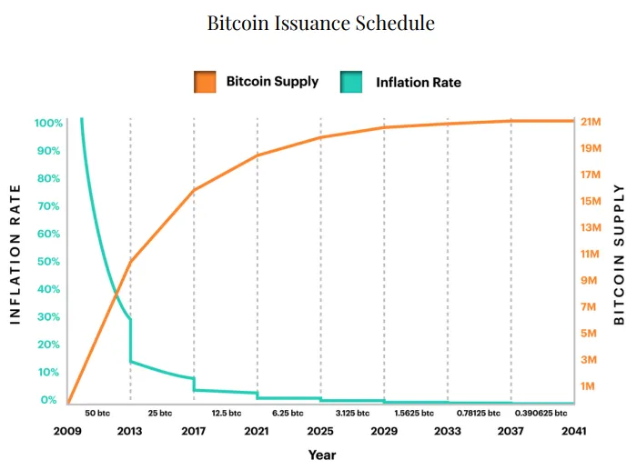

## Introduction

The Bitcoin halving on April 19, 2024, slashed the block reward from 6.25 BTC to 3.125 BTC at block 840,000, reducing daily issuance from 900 BTC to 450 BTC—worth ~\$27 million at \$60,000 per BTC. While miners felt the operational squeeze (as explored in Article 14), investors faced a different landscape, with prices stabilizing at \$63,000-\$64,000 after a \$73,000 pre-halving peak. Having covered the economic overview and miner impacts, we now turn to investors. In this fifteenth stop of our 30-part journey, we’ll examine how the 2024 halving influenced investment strategies, market sentiment, and long-term outlooks. How did this event shape the investor experience? Let’s dive in.

## Price Expectations: A Muted Outcome

Investors entered 2024 with high hopes, recalling past halvings: 2012’s climb to \$1,000, 2016’s peak at \$19,000, and 2020’s rise to \$69,000. The supply cut to 450 BTC/day, alongside Spot Bitcoin ETF inflows (\$208M/day pre-halving), fueled predictions of a \$100,000+ surge. Yet, post-halving, prices dropped to \$63,000-\$64,000 by March 2025—a 13% decline from \$73,000—defying the bull run narrative.

This muted response stemmed from pre-halving momentum. ETF demand peaked early, absorbing sell pressure, while ~19.7 million BTC were already mined, diluting scarcity’s impact. Investors, expecting instant gains, faced a reality check—halving effects might now lag, requiring patience in a maturing market.

## Investment Strategies: Diversification and Caution

The halving shifted investor strategies. Retail traders, burned by 2016’s \$3,000 crash, adopted caution, scaling back leveraged bets. Many diversified into ETFs or stablecoins, with BlackRock’s IBIT fund seeing \$10B in inflows by mid-2024. Institutional investors, like MicroStrategy, continued accumulation—adding 12,000 BTC post-halving—betting on long-term value.

Hodling intensified, with ~70% of BTC unmoved for over a year by mid-2024, per Glassnode data. Some investors sold pre-halving at \$73,000, locking in profits, while others bought the dip to \$63,000, anticipating a delayed rally. The halving pushed a strategic pivot—less speculation, more calculated moves in a \$1.2T market.

## Market Sentiment: Stability Over Hype

Sentiment on X and traditional media reflected this shift. Pre-halving, #BitcoinHalving2024 trended with bullish forecasts from influencers like @CryptoBull (\$100K by year-end). Post-halving, the tone turned mixed—some called it a “sell-the-news” event, others saw a “buy-the-dip” opportunity. By March 2025, sentiment stabilized, with analysts noting Bitcoin’s role as an inflation hedge amid 3.5% U.S. CPI.

Institutional confidence grew. ETF providers like Fidelity reported steady inflows, and global adoption (e.g., El Salvador’s Chivo wallet) reinforced optimism. The halving didn’t spark FOMO like 2016 or 2020; instead, it fostered a pragmatic outlook, with investors valuing stability over short-term gains.

## Long-Term Implications: A Maturing Asset

The 2024 halving signaled Bitcoin’s evolution as an investment. Its \$63,000-\$64,000 stability post-event, despite no surge, mirrored 2020’s steady climb, suggesting a maturing asset class. Investors began viewing Bitcoin as a portfolio diversifier, with 2-5% allocations recommended by firms like Grayscale, up from 1% in 2020.

The halving’s economic ripple—miners leaning on fees (~\$1.5M/day), ETF-driven demand—supported this shift. In high-inflation regions like Argentina (100%+ CPI), investors piled into BTC, with local exchanges reporting 15% volume growth post-halving. Globally, the event reinforced Bitcoin’s “digital gold” narrative, appealing to long-term holders over traders.

## Risks and Opportunities: Navigating the New Normal

The halving introduced risks. Price stagnation frustrated short-term traders, and regulatory uncertainty—e.g., potential U.S. tax hikes—loomed. Mining consolidation (20% small miners exiting) raised centralization concerns, potentially impacting network security if hash rate drops.

Opportunities emerged too. Delayed price growth could mirror 2012’s 12-month lag, with mid-2025 a potential target if demand rises (e.g., ETF adoption). The fee economy, boosted by ordinals, hinted at new revenue for investors via mining stocks or BTC staking platforms. The 2024 halving offered a balanced landscape—risks tempered by strategic gains.

## Conclusion

The 2024 halving reshaped the investor landscape, with a \$63,000-\$64,000 price stability replacing the expected surge. It drove cautious diversification, shifted sentiment toward stability, and positioned Bitcoin as a maturing asset, especially in inflationary contexts. On April 19, 2024, the cut to 3.125 BTC tested investor resilience, revealing a market ready for long-term value over short-term hype. Next in Article 16, we’ll explore its global adoption impact. What surprised you most as an investor in 2024? Join us to broaden the view.
