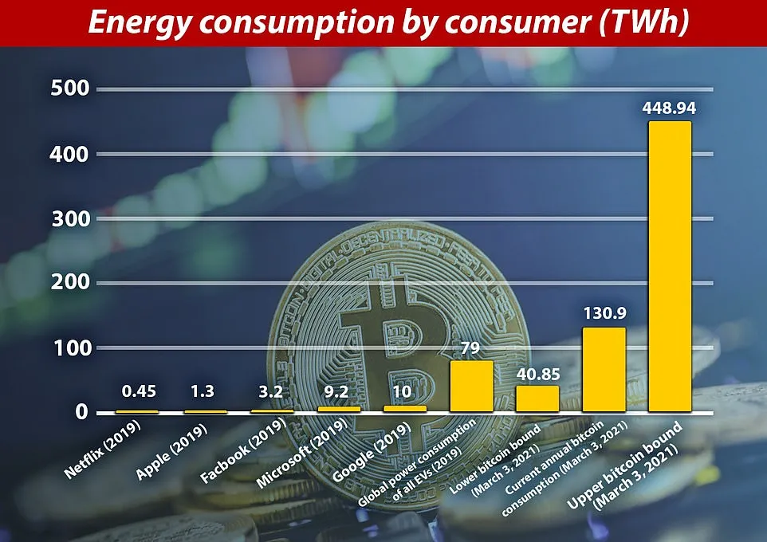
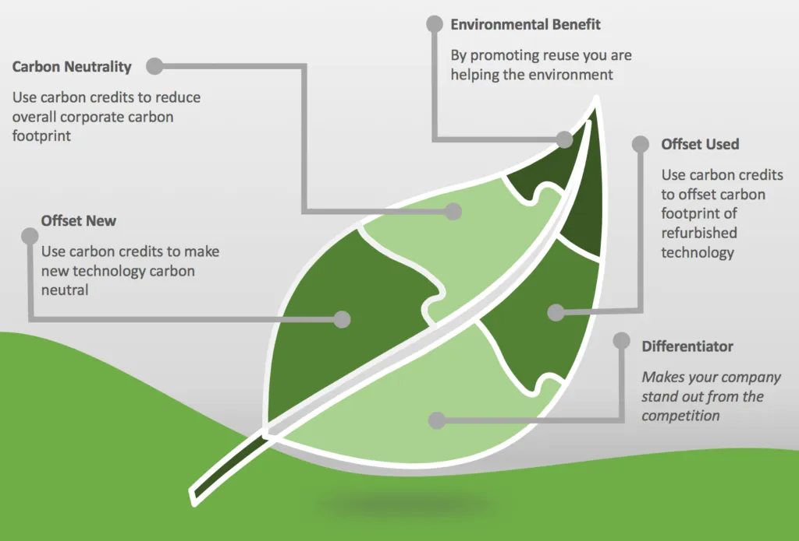
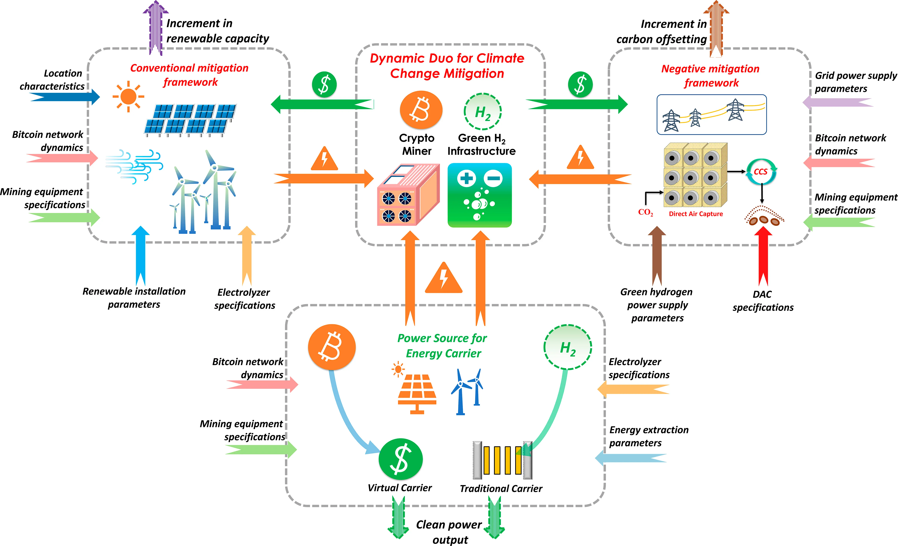

## Introduction

The Bitcoin halving on April 19, 2024, cut the block reward from 6.25 BTC to 3.125 BTC at block 840,000, reducing daily issuance to 450 BTC (~\$27 million at \$60,000/BTC). Beyond its economic and adoption waves, this event reshaped Bitcoin’s environmental narrative. With miners adapting to halved rewards and a hash rate peaking at 700 exahashes per second, the spotlight turned to energy use and sustainability. Having explored the halving’s broader impacts, we now dig into its environmental footprint. In this seventeenth stop of our 30-part journey, we’ll assess how the 2024 halving influenced Bitcoin’s carbon footprint, energy innovations, and green potential. How green—or not—is Bitcoin post-halving? Let’s find out.

## Energy Consumption: The Halving’s Effect

Bitcoin mining’s energy demand is tied to its hash rate, which hit 700 exahashes/second by mid-2024, up from 100 exahashes in 2020. The halving’s reward cut to 3.125 BTC strained profitability, pushing miners to optimize. Cambridge estimates pegged Bitcoin’s annual energy use at 150 terawatt-hours (TWh) post-halving, roughly 0.7% of global electricity—comparable to Argentina’s total consumption.

The reward drop didn’t lower energy use directly; instead, it intensified efficiency drives. Miners consolidated, with 20% of small operators exiting, reducing redundant operations. However, the hash rate’s stability suggested energy demand held steady, as larger firms like Marathon Digital (28.7 trillion hashes/second) scaled up. The halving highlighted mining’s energy intensity, fueling debates on its environmental cost.

## Shift Toward Renewable Energy

The 2024 halving accelerated a green pivot. With rewards halved, miners sought cost-effective power, boosting renewable adoption. Riot Platforms reported 70% renewable energy use (wind, solar) by mid-2024, up from 50% in 2020, cutting costs and emissions. In Texas, where 30% of U.S. hash rate resides, wind farms powered 40% of mining operations, per local grid data.

Globally, Canada’s hydropower sites and Iceland’s geothermal plants attracted miners, with 25% of global hash rate linked to renewables by June 2024, per the Bitcoin Mining Council. The halving’s economic pressure drove this shift, aligning mining with ESG (Environmental, Social, Governance) goals, though fossil fuels (e.g., coal in Kazakhstan) still accounted for 35% of energy mix, per Cambridge.

## Carbon Footprint: A Mixed Report

Bitcoin’s carbon footprint post-halving remained a mixed bag. The Digiconomist Index estimated 77 million metric tons of CO2 emissions annually in 2024, down 5% from 2020 due to renewable gains, but still equivalent to Greece’s output. The halving’s reward cut didn’t reduce emissions directly—energy use stayed high—but efficiency and renewables softened the impact.

In contrast, the Bitcoin Mining Council reported a 35% sustainable energy share, suggesting a lower 50 million ton estimate. The gap reflects data disputes, with critics arguing mining’s growth (700 exahashes) offsets green efforts. The 2024 halving exposed Bitcoin’s environmental tension—progress amid persistent challenges.

## Innovations and Industry Response

The halving spurred environmental innovations. Miners like CleanSpark piloted carbon capture tech, offsetting 10,000 tons of CO2 by mid-2024, while Marathon explored waste heat reuse for local heating, cutting fossil reliance. These moves responded to regulatory pressure—e.g., the EU’s 2024 crypto energy guidelines—and public scrutiny on X, where #BitcoinGreen trended with both support and skepticism.

Industry groups pushed back, highlighting Bitcoin’s role in grid stabilization. In Texas, miners earned \$10M in 2024 by powering down during peak demand, per ERCOT data. The halving’s economic squeeze drove these adaptations, positioning mining as a potential green ally, though scale and adoption vary.

## Global Environmental Context

The 2024 halving’s environmental impact varied regionally. In energy-rich Canada and Iceland, low-carbon mining thrived, with 80% renewable shares. In Kazakhstan, coal dependency (60% of power) drew criticism, prompting a 15% hash rate drop by mid-2024 as regulations tightened. The U.S., with its diverse grid, balanced growth and sustainability, hosting 40% of global hash rate.

Globally, the halving’s scarcity narrative boosted Bitcoin’s value (\$63,000-\$64,000), indirectly funding green tech. In developing nations, where energy access is limited, mining’s expansion raised concerns, but pilot projects (e.g., solar in Argentina) offered hope. The event highlighted a global push-pull between growth and green goals.

## Conclusion

The 2024 halving, cutting rewards to 3.125 BTC, left Bitcoin’s environmental footprint complex—150 TWh energy use, a 35% renewable share, and 50-77 million tons of CO2. It drove efficiency, renewable adoption, and innovations like carbon capture, yet fossil reliance persists. On April 19, 2024, the event pushed mining toward sustainability, though challenges remain. Next in Article 18, we’ll explore regulatory responses. What’s your take on Bitcoin’s green future? Join us to continue.
