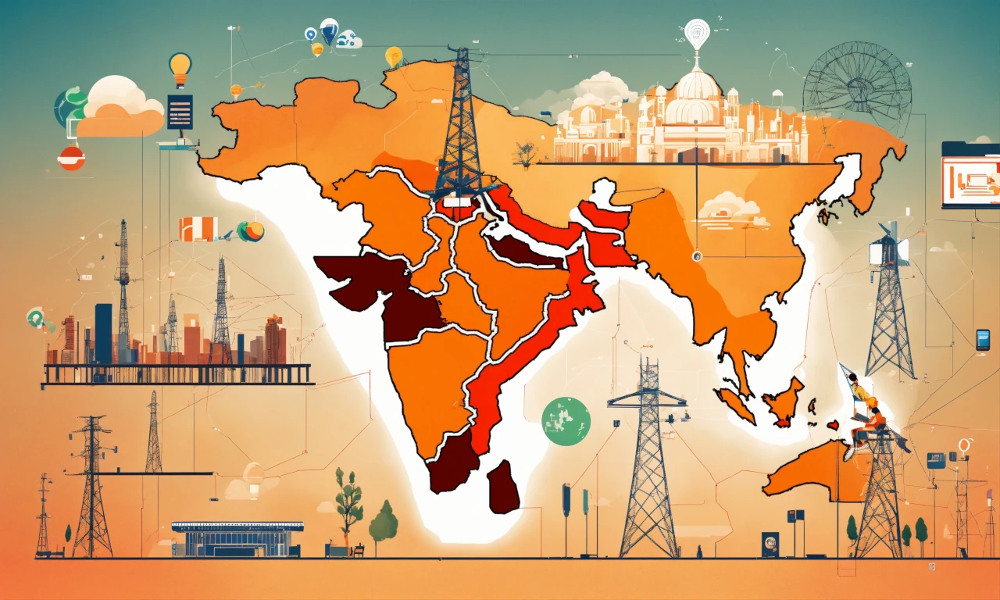
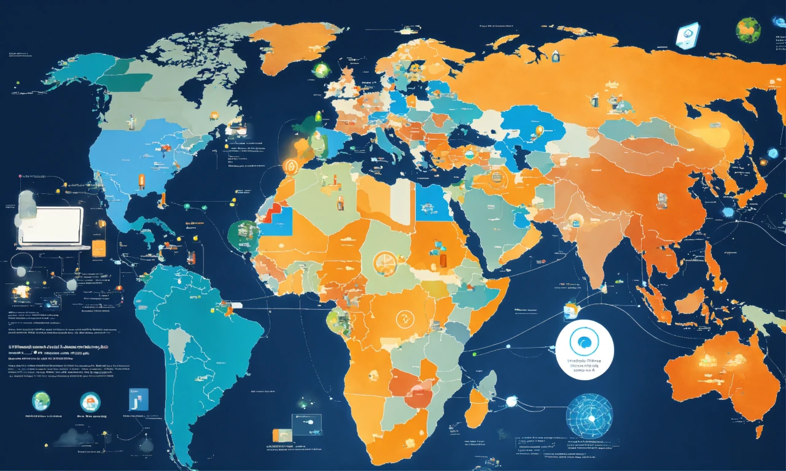

## Introduction

The Bitcoin halving on April 19, 2024, cut the block reward from 6.25 BTC to 3.125 BTC at block 840,000, reducing daily issuance to 450 BTC (~\$27 million at \$60,000/BTC). While this event reshaped economics, adoption, and environmental debates, it also caught the eye of global regulators. With Bitcoin stabilizing at \$63,000-\$64,000 and its market cap at \$1.2 trillion, governments took notice. Having explored the halving’s broader impacts, we now turn to policy. In this eighteenth stop of our 30-part journey, we’ll examine how regulators worldwide responded to the 2024 halving, from supportive measures to restrictive crackdowns. How did policy shape Bitcoin’s path? Let’s investigate.

## U.S. Response: A Balanced Approach

The U.S., a hub for 40% of global hash rate, reacted pragmatically. The January 2024 Spot Bitcoin ETF approvals, driving \$208M/day in inflows, set a supportive tone pre-halving. Post-halving, the SEC maintained this stance, approving additional ETF products by June, with BlackRock’s IBIT fund hitting \$15B. However, regulatory scrutiny grew—proposed tax hikes on crypto gains (e.g., 30% capital gains tax floated in 2024 budget talks) aimed to curb speculative trading.

Energy concerns also surfaced. The U.S. Energy Information Administration (EIA) launched mandatory energy reporting for miners, citing Bitcoin’s 150 TWh annual consumption. States like Texas incentivized renewables with tax breaks, aligning with the halving’s push toward sustainability (e.g., Riot’s 70% renewable use). The U.S. balanced innovation with oversight, reflecting Bitcoin’s growing mainstream presence.

## EU and Environmental Oversight

The European Union, focused on sustainability, tightened its grip post-halving. The EU’s 2024 Crypto Energy Guidelines, part of the MiCA framework, required miners to disclose carbon footprints, responding to Bitcoin’s estimated 50-77 million tons of CO2 emissions. Non-compliance risked fines up to €500,000, pushing firms to adopt renewables—25% of EU-based hash rate shifted to green energy by mid-2024.

At the same time, the EU embraced adoption. Germany and France saw 15% more merchants accepting BTC post-halving, supported by clear tax rules (e.g., VAT exemptions on crypto transactions). The halving’s stability (\$63,000-\$64,000) reassured regulators, but environmental concerns dominated, with X debates like #BitcoinGreen highlighting the tension between growth and regulation.

## Asia: A Tale of Contrasts

Asia’s response was polarized. In China, the 2021 mining ban held firm, with no policy shift post-halving, leaving its hash rate negligible. Kazakhstan, hosting 15% of global hash rate, tightened regulations—new licensing fees and a 10% tax on mining profits were introduced in May 2024, prompting a 15% hash rate drop as miners relocated.

Conversely, South Korea leaned in. The halving’s spotlight on ordinals (generating ~\$200M in fees) drove a 20% user increase on Dunamu, prompting tax deferrals on crypto gains until 2026. Japan clarified BTC as a legal asset, boosting adoption with 10% more retail investors by June. Asia’s split response—restrictive in some, progressive in others—mirrored Bitcoin’s uneven global path.

## Developing Nations: Adoption vs. Control

In developing regions, the halving fueled adoption but sparked regulatory pushback. El Salvador, a Bitcoin legal tender pioneer, doubled down—post-halving, Chivo wallet usage rose 10%, and a 2024 law allowed BTC bonds for infrastructure, raising \$50M by July. The halving’s scarcity narrative (3.125 BTC/block) bolstered its inflation-hedging appeal (e.g., Venezuela’s 300% CPI).

Nigeria, however, cracked down. Despite a 12% rise in P2P trading post-halving, the government restricted crypto exchanges, citing financial instability, though enforcement lagged. Argentina balanced both—supporting BTC as a hedge (15% volume surge on Ripio) while introducing KYC rules to curb money laundering. The halving exposed a regulatory tug-of-war: adoption vs. control.

## Global Trends and Future Implications

The 2024 halving revealed global regulatory trends. Energy oversight grew, with the U.S. and EU pushing miners toward renewables, aligning with the industry’s 35% sustainable energy share. Adoption-friendly policies in South Korea, Japan, and El Salvador contrasted with restrictions in China and Nigeria, reflecting Bitcoin’s dual role as opportunity and threat.

Future implications loom. The halving’s stability suggests regulators may ease speculative fears, but environmental and tax pressures will tighten—e.g., potential G20 crypto tax frameworks by 2026. Miners and investors must navigate this evolving landscape, with 2028’s 1.5625 BTC reward likely facing even stricter rules.

## Conclusion

The 2024 halving, cutting rewards to 3.125 BTC, prompted varied regulatory responses. The U.S. balanced support and oversight, the EU prioritized sustainability, Asia split between crackdowns and progress, and developing nations weighed adoption against control. On April 19, 2024, Bitcoin’s \$1.2T market faced a new policy reality, shaping its global trajectory. Next in Article 19, we’ll explore technological innovations post-halving. How do you see regulation evolving? Join us to dive deeper.
