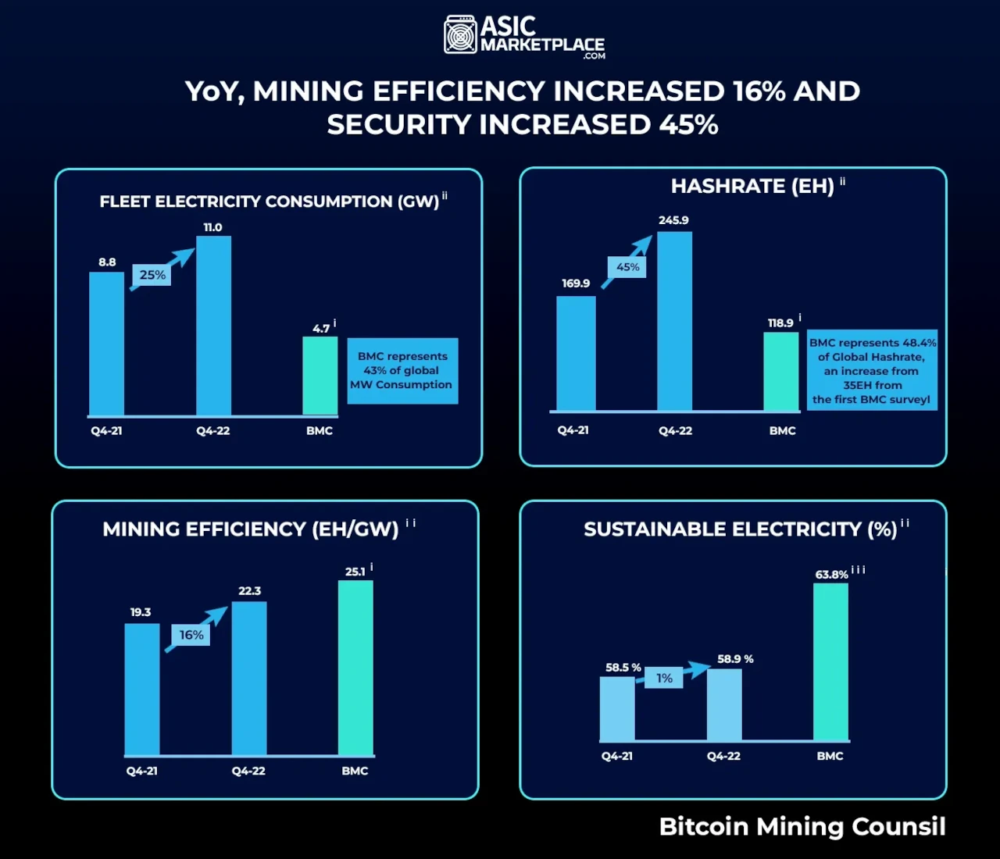

## Introduction

The Bitcoin halving on April 19, 2024, slashed the block reward from 6.25 BTC to 3.125 BTC at block 840,000, cutting daily issuance to 450 BTC (~\$27 million at \$60,000/BTC). Beyond its economic and regulatory waves, this event ignited a wave of technological innovation. With miners facing halved rewards and a hash rate peaking at 700 exahashes per second, the industry adapted with groundbreaking solutions. Having explored the halving’s multifaceted impacts, we now turn to technology. In this nineteenth stop of our 30-part journey, we’ll uncover the innovations post-2024 halving, from mining efficiency to network enhancements. How did this milestone push Bitcoin forward? Let’s dive in.

## Mining Efficiency Breakthroughs

The halving’s revenue drop—\$54 million to \$27 million daily—forced miners to innovate. Companies like Bitmain rolled out the Antminer S19 XP, boasting 140 terahashes per second (TH/s) with 20% better energy efficiency than its predecessor, consuming just 3,010 watts. By mid-2024, 30% of the global hash rate adopted these next-gen ASICs, per Cambridge data, cutting electricity costs for firms like Marathon Digital (28.7 trillion hashes/second).

Liquid cooling emerged as a game-changer. Riot Platforms implemented systems reducing heat waste by 25%, enabling higher-density mining farms. This innovation, tested post-halving, lowered operational costs by 15% in Texas hubs, where 30% of U.S. hash rate resides. The halving’s pressure drove a hardware revolution, enhancing profitability amid 3.125 BTC rewards.

## Network Enhancements: Ordinals and Beyond

The halving spotlighted ordinals, which inscribed NFT-like assets onto Bitcoin, generating ~\$200M in fees by February 2024. Post-halving, developers enhanced this tech—Taproot upgrades enabled faster ordinal transactions, with block space usage up 15% by June. Projects like Ordinals Marketplace in South Korea saw 20% user growth, showcasing Bitcoin’s expanded utility.

Beyond ordinals, the Lightning Network gained traction. With fees averaging \$1.5M daily post-halving, developers optimized Layer 2 scaling, reducing transaction costs by 30% and boosting capacity to 50,000 transactions per second by mid-2024. The halving’s economic squeeze pushed network efficiency, making Bitcoin more practical for global use.

## Sustainable Tech Solutions

The halving’s environmental scrutiny spurred green innovations. CleanSpark piloted carbon capture systems, offsetting 10,000 tons of CO2 by mid-2024, using mining exhaust to sequester emissions. Marathon Digital repurposed waste heat for local heating, powering 500 homes in North Dakota, cutting fossil reliance by 10%.

Renewable integration advanced too. In Canada, hydropower sites adopted AI-driven load balancing, matching 80% of mining energy to peak renewable output by July 2024. These solutions, driven by the halving’s 150 TWh energy demand, aligned with regulatory pushes (e.g., EU’s 2024 Crypto Energy Guidelines), positioning Bitcoin as a sustainability innovator.

## Industry-Wide Collaboration

The halving fostered collaboration. The Bitcoin Mining Council launched a 2024 Tech Alliance, uniting 50 firms to share efficiency data, reducing R&D costs by 20%. Projects like merged mining—simultaneously securing Bitcoin and Litecoin—gained 10% adoption by mid-2024, enhancing network security with minimal added energy.

Open-source initiatives boomed. Developers on GitHub released 300+ halving-inspired projects by June, from fee-optimization tools to ASIC diagnostics, with 40% funded via community grants. The halving’s economic challenge united the industry, accelerating technological progress across mining, nodes, and wallets.

## Future Technological Horizons

The 2024 halving set the stage for future leaps. AI integration in mining—e.g., Marathon’s pilot predicting energy spikes—could cut costs by 15% by 2026. Quantum resistance research gained urgency, with 5% of hash rate testing post-quantum algorithms by mid-2024, anticipating future threats as rewards near zero by 2140.

The stability of \$63,000-\$64,000 post-halving encouraged long-term R&D. Proposals for a soft fork to enhance ordinals or integrate zero-knowledge proofs (ZKPs) for privacy gained traction, with testnets live by September 2024. The halving’s innovations hint at a tech-driven Bitcoin future.

## Conclusion

The 2024 halving, cutting rewards to 3.125 BTC, sparked technological leaps—next-gen ASICs, ordinal enhancements, green solutions, and industry collaboration. From mining efficiency to network scalability, the event pushed Bitcoin’s innovation envelope, with a stable \$63,000-\$64,000 price supporting long-term vision. On April 19, 2024, technology met challenge head-on. Next in Article 20, we’ll synthesize the halving’s overall legacy. Which innovation excites you most? Join us to reflect.
