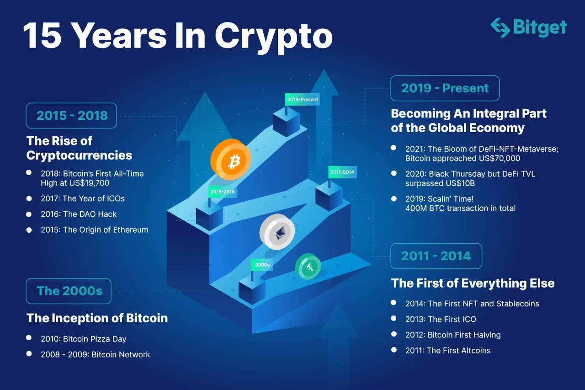

## Introduction

On April 19, 2024, the fourth Bitcoin halving cut the block reward from 6.25 BTC to 3.125 BTC at block 840,000, reducing daily issuance to 450 BTC (~\$27 million at \$60,000/BTC). Unlike the explosive runs of 2012, 2016, or 2020, prices stabilized at \$63,000-\$64,000 by March 2025, marking a new chapter. Across Section 2, we’ve dissected its economic ripples, miner resilience, investor shifts, global adoption, environmental footprint, regulatory responses, and technological leaps. In this twentieth stop of our 30-part journey, we’ll weave these threads into the legacy of the 2024 halving. What lasting mark did this event leave on Bitcoin? Let’s reflect.

## A Maturing Market Ecosystem

The 2024 halving cemented Bitcoin’s transition to maturity. The \$1.2 trillion market cap and 700 exahashes/second hash rate underscored a network robust enough to absorb a 50% reward cut without chaos. Prices, peaking at \$73,000 pre-halving and settling at \$63,000-\$64,000, reflected a market less driven by speculation and more by fundamentals—Spot Bitcoin ETF inflows (\$208M/day) and ordinal fees (~\$200M by February) stabilized demand.

This maturity echoed 2020’s steady climb to \$69,000 but outpaced 2016’s crash to \$3,000. The halving’s legacy is a Bitcoin ecosystem where institutional trust (e.g., BlackRock’s \$15B IBIT) and hodling (~70% of BTC unmoved) prioritize long-term value, setting a precedent for future cycles.

## Resilience and Adaptation

Miners’ response defined the halving’s legacy. The revenue drop from \$54 million to \$27 million daily forced 20% of small operators to exit, but giants like Marathon Digital (26,747 BTC reserves) and Riot Platforms (70% renewable energy) adapted. Innovations like liquid cooling and ordinal fee reliance (\$1.5M/day) showcased resilience, mirroring past cycles’ evolution from 2012’s DIY rigs to 2024’s industrial scale.

This adaptability extended to technology—next-gen ASICs (e.g., Antminer S19 XP) and green solutions (carbon capture offsetting 10,000 tons) emerged. The halving’s legacy is a miner community that thrives through innovation, ensuring Bitcoin’s security as rewards dwindle to zero by 2140.

## Global Reach and Inclusion

The 2024 halving boosted Bitcoin’s global footprint. In inflation-hit regions like Argentina (15% volume surge on Ripio) and Nigeria (12% P2P growth), it became a wealth preservation tool, echoing El Salvador’s 10% remittance rise. Institutional adoption in the U.S. and Europe, paired with ordinal-driven tech growth in South Korea (20% user increase), expanded its reach.

Despite regulatory hurdles—China’s ban, Kazakhstan’s taxes—the halving’s stability (\$63,000-\$64,000) encouraged adoption-friendly policies (e.g., Japan’s legal asset status). Its legacy is a more inclusive Bitcoin, bridging developed and developing economies, with 19.7 million BTC mined reinforcing its scarcity narrative.

## Environmental and Regulatory Crossroads

The halving’s environmental legacy is dual-edged. Energy use held at 150 TWh, with a 35% renewable share (up from 25% in 2020), driven by Canada’s hydropower and Texas wind farms. Innovations like waste heat reuse powered 500 homes, but CO2 emissions (50-77 million tons) remained a concern, prompting U.S. and EU oversight (e.g., energy reporting, MiCA guidelines).

Regulators responded variably—supportive ETFs in the U.S., restrictive taxes in Nigeria—shaping a cautious yet progressive framework. The halving’s legacy is a push toward sustainability and regulation, with Bitcoin at a crossroads: balancing growth with green accountability as 2028’s 1.5625 BTC reward nears.

## Technological Foundation for the Future

Technological strides post-halving laid a lasting foundation. Ordinals enhanced utility, with Taproot optimizations boosting transaction efficiency by 15%. The Lightning Network scaled to 50,000 transactions per second, and AI-driven mining (e.g., Marathon’s energy predictions) cut costs by 15%. Collaborative efforts, like the Bitcoin Mining Council’s Tech Alliance, reduced R&D costs by 20%.

These innovations, supported by a stable \$63,000-\$64,000 price, hint at a future with quantum resistance and zero-knowledge proofs (ZKPs) by 2026. The halving’s legacy is a technologically robust Bitcoin, ready for mainstream integration.

## The Broader Legacy: A New Era

The 2024 halving’s legacy is a Bitcoin entering a new era—mature, resilient, global, and innovative, yet facing environmental and regulatory challenges. It shifted focus from speculative booms to sustainable growth, with the 3.125 BTC reward symbolizing a network that adapts rather than breaks. Unlike past cycles, it prioritized utility (ordinals, Lightning) over hype, setting a template for 2028 and beyond.

This event redefined Bitcoin’s narrative—from a volatile experiment to a stabilizing force. Its \$63,000-\$64,000 stability post-halving, amid global adoption and tech leaps, marks a legacy of endurance and evolution, shaping its role in the next decade.

## Conclusion

The 2024 halving’s legacy is a mature Bitcoin ecosystem—resilient miners, global inclusion, environmental progress, regulatory balance, and technological leaps—built on a stable \$63,000-\$64,000 foundation. On April 19, 2024, the cut to 3.125 BTC didn’t just halve rewards; it heralded a new phase. As Section 2 closes, Section 3 begins with Article 21 on future predictions. What’s the most enduring legacy for you? Join us to look ahead.
