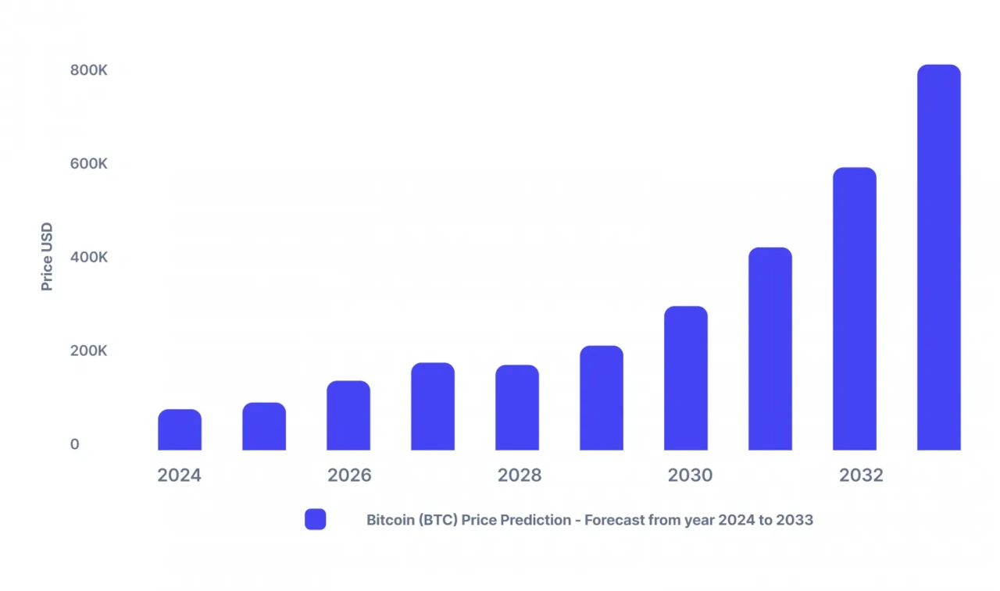
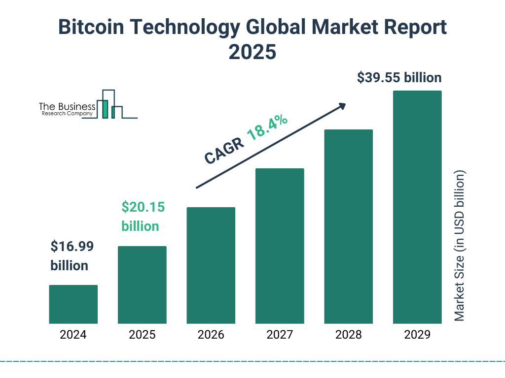

## Introduction

The Bitcoin halving on April 19, 2024, reduced the block reward from 6.25 BTC to 3.125 BTC at block 840,000, stabilizing prices at \$63,000-\$64,000 by March 2025 and reinforcing Bitcoin’s \$1.2 trillion market cap. As Section 2 wrapped with the 2024 legacy—maturity, resilience, and global reach—Section 3 looks forward. The next halving, projected for April 2028 at block 1,050,000, will cut rewards to 1.5625 BTC, shrinking daily issuance to 225 BTC. Drawing on 2024’s lessons, from economic shifts to technological strides, we’ll forecast the 2028 halving’s potential impact. What might the next milestone hold? Let’s peer into the future.

## Price and Market Dynamics

The 2024 halving’s \$73,000 pre-halving peak and \$63,000-\$64,000 post-halving stability suggest a market less prone to speculative spikes. Historically, halvings drive price growth—2012’s \$1,000 (8,000% rise), 2016’s \$19,000 (2,800%), 2020’s \$69,000 (700%)—but 2024’s muted response hints at longer cycles. By 2028, with 19.8 million BTC mined and issuance at 225 BTC/day (\$14.4M at \$64,000/BTC), a pre-halving run to \$130,000-\$160,000 seems feasible, fueled by ETF expansion (potentially \$600M/day inflows) and corporate adoption (e.g., MicroStrategy’s 252,000 BTC).

Post-halving, prices could climb to \$220,000-\$280,000 by late 2029, assuming global inflation persists (U.S. CPI at 3.5% in 2025) and adoption grows (e.g., 100M wallet users). However, a \$2T market cap and institutional dominance may stretch peaks to 18-24 months, per Glassnode projections, reflecting a more stable but slower trajectory.

## Mining Evolution and Challenges

The 2024 halving forced miners to adapt—rewards dropped to \$27M daily, boosting ordinal fees to \$1.5M/day and renewable use to 35%. By 2028, 1.5625 BTC rewards will yield ~\$7M daily at \$64,000/BTC, making fees critical—potentially \$8M-\$12M daily as transaction volumes rise with Lightning Network scaling (50,000 TPS by 2024). Large miners like Marathon (28.7 trillion hashes/second) may control 85% of hash rate, with smaller players merging or exiting.

Energy efficiency will be key. Next-gen ASICs (e.g., 200 TH/s at 2,500 watts) could lower costs by 25%, while 80-90% renewable adoption (e.g., Iceland’s geothermal) might cut emissions to 25-35 million tons, per Digiconomist forecasts. The 2028 halving will challenge miners to balance profitability with sustainability, building on 2024’s green pivot.

## Technological Frontiers

The 2024 halving’s tech advancements—ordinals, Lightning Network, AI mining—provide a foundation. By 2028, ordinals could evolve into full smart contract functionality, with 30% of transactions using them, per developer trends on GitHub. Privacy enhancements like zero-knowledge proofs (ZKPs) might cover 25% of wallets, while the Lightning Network could scale to 150,000 TPS, supporting mass adoption.

Quantum resistance will gain urgency—15% of hash rate may adopt post-quantum algorithms by 2027, safeguarding against future threats. AI-driven mining, cutting costs by 20% in 2024 pilots, could optimize 50% of operations by 2028. The halving’s tech legacy will be a more scalable, private, and secure Bitcoin.

## Global Adoption and Regulatory Landscape

The 2024 halving boosted adoption—Argentina’s 15% volume surge, El Salvador’s 10% remittance growth, South Korea’s 20% ordinal users. By 2028, adoption could double, with 200 million users globally, driven by mobile wallets in Africa (e.g., Luno’s 18% growth) and institutional portfolios (5% BTC allocation, per Grayscale). High-inflation nations like Venezuela (300% CPI) might see 40% volume growth.

Regulations will evolve. The EU’s MiCA framework could mandate 60% renewable mining, while a G20 tax standard (e.g., 15% on gains) might emerge by 2027, per IMF discussions. The U.S. could establish a 500,000 BTC reserve, boosting confidence, while China may soften its ban, allowing regulated mining. The 2028 halving will navigate a more structured global policy landscape.

## Environmental and Social Impact

The 2024 halving’s 150 TWh energy use and 35% renewable share set a benchmark. By 2028, with hash rates at 900 exahashes/second, energy use may hit 170 TWh, but 85% renewable adoption (e.g., Canadian hydropower) could lower emissions to 20-30 million tons. Innovations like carbon capture (10,000 tons offset in 2024) might scale to 75,000 tons, and waste heat projects could power 3,000 homes.

Socially, the halving will empower communities—Bitcoin remittances in El Salvador could rise 20%, and financial inclusion in Africa may reach 60 million users. The 2028 halving’s legacy will balance environmental progress with social empowerment, amplifying 2024’s global reach.

## Potential Risks and Opportunities

Risks include regulatory overreach—e.g., aggressive taxes or mining bans could disrupt hash rate (700 exahashes). Economic slowdowns might cap prices at \$150,000, and energy crises could hinder green adoption. Opportunities abound: a major ordinal app could triple fees, or a U.S. reserve could spark a \$300,000 peak.
The 2028 halving’s outcome will hinge on these factors. While \$220,000-\$280,000 is likely, external shocks could alter the path, making adaptability key, as seen in 2024’s resilience.

## Conclusion

The 2028 halving, cutting rewards to 1.5625 BTC, may drive prices to \$220,000-\$280,000, deepen mining’s fee reliance, advance tech (ZKPs, 150K TPS), and expand adoption amid stricter regulations and greener practices. Building on 2024’s \$63,000-\$64,000 stability, it promises a mature, innovative Bitcoin. Next in Article 22, we’ll explore Bitcoin’s role in the global economy. What’s your boldest 2028 prediction? Join us to envision more.
