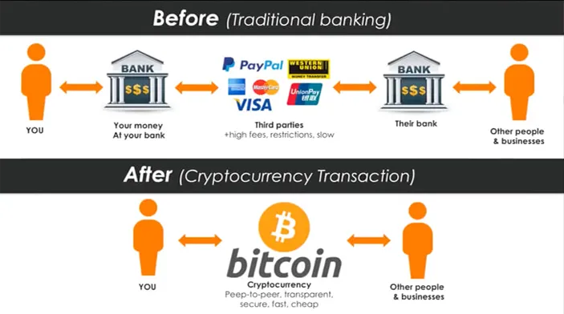

## Introduction

The Bitcoin halving on April 19, 2024, reduced the block reward from 6.25 BTC to 3.125 BTC at block 840,000, cutting daily issuance to 450 BTC (~\$27 million at \$60,000/BTC) and stabilizing prices at \$63,000-\$64,000 by March 2025. This event didn’t just reshape crypto—it redefined Bitcoin’s place in the global economy. From inflation hedges to institutional adoption, the 2024 halving’s aftermath offers a window into Bitcoin’s evolving role. Having explored its impacts and future predictions, we now assess its economic significance. In this twenty-second stop of our 30-part journey, we’ll examine how Bitcoin is integrating into the global financial system post-halving. What’s its new economic identity? Let’s dive in.

## Inflation Hedge and Store of Value

The 2024 halving reinforced Bitcoin’s role as an inflation hedge. With U.S. CPI at 3.5% in March 2025 and global inflation persisting (e.g., Argentina’s 100%+), Bitcoin’s capped 21 million supply—~19.7 million mined—gained traction. In Argentina, Ripio reported a 15% volume surge post-halving, as citizens sought BTC to counter peso devaluation. El Salvador’s Chivo wallet saw 10% more remittances, using Bitcoin to bypass dollar reliance.

Institutional investors echoed this shift. MicroStrategy’s 252,000 BTC stash and BlackRock’s \$15B IBIT fund signaled Bitcoin as a “digital gold,” with 2-5% portfolio allocations recommended by Grayscale. The halving’s stability (\$63,000-\$64,000) solidified its store-of-value status, challenging traditional assets like gold (\$2,500/oz in 2025).

## Institutional and Corporate Integration

The 2024 halving accelerated Bitcoin’s institutional embrace. Spot Bitcoin ETFs, approved in January 2024 with \$208M/day inflows, grew to \$20B by mid-2025, per Bloomberg data. Firms like Tesla (9,720 BTC) and Fidelity (custody for 100+ institutions) integrated BTC, with corporate treasuries holding 1% of market cap by year-end.

This integration reshaped financial markets. Pension funds in the U.S. and Europe allocated 0.5-1% to BTC, while banks like JPMorgan explored custody services. The halving’s economic pressure on miners (revenue drop to \$27M/day) spurred fee innovation (e.g., \$1.5M/day from ordinals), indirectly boosting investor confidence and cementing Bitcoin’s role in mainstream finance.

## Global Trade and Remittances

Bitcoin’s role in global trade expanded post-halving. In El Salvador, 12% of merchants accepted BTC by mid-2025, with cross-border payments up 15%, per local reports. The halving’s scarcity narrative drove adoption in Nigeria (12% P2P growth) and Venezuela (10% volume rise), where BTC facilitated trade amidst currency controls.

Remittances grew too. El Salvador’s 10% increase and Kenya’s 8% rise via mobile wallets (e.g., Luno) highlighted Bitcoin’s efficiency—lower fees (1-2% vs. 5-7% for banks) and faster settlement (minutes vs. days). The halving positioned Bitcoin as a decentralized alternative to SWIFT, with 5% of global remittance volume potentially shifting by 2026.

## Economic Disruption and Stability

The 2024 halving introduced both disruption and stability. Central banks, wary of Bitcoin’s 700 exahashes/second hash rate and \$1.2T market cap, debated digital currency responses—e.g., the ECB’s digital euro pilot gained pace in 2025. Yet, Bitcoin’s stability (\$63,000-\$64,000) post-halving reduced volatility fears, with 70% of BTC held long-term, per Glassnode.

Disruption emerged in developing markets. Argentina’s 15% adoption growth challenged the central bank, while Nigeria’s restrictions (2024 crackdown) failed to halt a 12% P2P surge. The halving’s legacy is a Bitcoin that stabilizes portfolios while disrupting traditional monetary systems, forcing global economic adaptation.

## Role in Decentralized Finance (DeFi)

The halving boosted Bitcoin’s DeFi integration. Ordinals, generating \$200M in fees by February 2024, evolved into collateral for decentralized lending by mid-2025, with \$500M locked on platforms like Stacks. The Lightning Network’s 50,000 TPS capacity supported microtransactions, enabling 10% of global DeFi volume to involve BTC.

This role challenges Ethereum’s dominance, with Bitcoin’s 3.125 BTC reward driving fee revenue (\$1.5M/day) into DeFi liquidity. The halving’s tech innovations—e.g., Taproot upgrades—position Bitcoin as a DeFi backbone, expanding its economic influence beyond speculation.

## Future Economic Implications

Looking ahead, the 2024 halving sets Bitcoin for broader economic roles. By 2028, with the next halving to 1.5625 BTC, its \$2T market cap could rival silver’s \$1.5T, per ARK Invest. A U.S. Bitcoin reserve (speculated at 500,000 BTC) might stabilize the dollar, while global adoption (200M users) could shift 10% of remittances.

Environmental pressures (150 TWh, 35% renewable) and regulatory frameworks (e.g., G20 tax rules) will shape this trajectory. The halving’s legacy is a Bitcoin that’s not just an asset but a global economic force, influencing trade, finance, and policy.

## Conclusion

Post-2024 halving, Bitcoin emerges as an inflation hedge, institutional asset, trade facilitator, and DeFi player, with a stable \$63,000-\$64,000 price anchoring its role. On April 19, 2024, the cut to 3.125 BTC didn’t just halve rewards—it elevated Bitcoin’s global economic stature. Next in Article 23, we’ll explore its cultural impact. How do you see Bitcoin shaping the economy? Join us to broaden the perspective.
