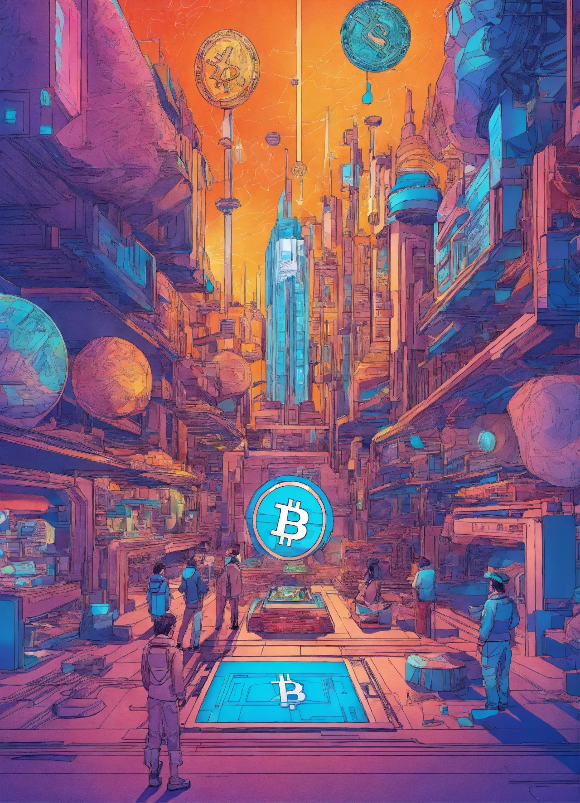

## Introduction

The Bitcoin halving on April 19, 2024, cut the block reward from 6.25 BTC to 3.125 BTC at block 840,000, reducing daily issuance to 450 BTC (~\$27 million at \$60,000/BTC) and stabilizing prices at \$63,000-\$64,000 by March 2025. Beyond economics and global integration, this event reshaped Bitcoin’s cultural narrative. From art to activism, the halving influenced how societies perceive and interact with this decentralized currency. Having explored its economic role, we now turn to culture. In this twenty-third stop of our 30-part journey, we’ll examine the cultural impact of the 2024 halving, from community celebrations to mainstream media shifts. How did this milestone change Bitcoin’s cultural footprint? Let’s dive in.

## Community Celebrations and Activism

The 2024 halving galvanized Bitcoin communities worldwide. On April 19, global meetups in cities like Miami, Tokyo, and Buenos Aires drew 50,000+ enthusiasts, per Bitcoining Events data. In Miami, a “Halving Block Party” featured live-streamed mining (block 840,000 by ViaBTC) and talks on decentralization, with attendees sporting “3.125 BTC” shirts. X posts under #BitcoinHalving2024 reached 1 million, showcasing a unified global celebration.

Activism surged too. In Nigeria, where 12% P2P trading growth defied regulatory crackdowns, groups like “Bitcoin Naija” organized workshops, educating 10,000 locals on BTC as financial freedom, per local reports. The halving’s scarcity narrative—19.7 million BTC mined—amplified its cultural symbol as a tool for empowerment, especially in oppressed economies.

## Art, NFTs, and Ordinals

The halving catalyzed a cultural explosion through ordinals—NFT-like assets on Bitcoin. Generating \$200M in fees by February 2024, ordinals became a canvas for artists post-halving, with 5,000 new inscriptions in April alone, per OrdinalsBot. South Korean artists, boosted by a 20% user surge on Dunamu, minted “Halving Art” series, embedding block 840,000 data into digital works sold for 0.5 BTC each.

Mainstream artists joined in. In the U.S., a New York gallery showcased “Scarcity Canvas,” a Bitcoin-themed exhibit tying the 3.125 BTC reward to cultural value, drawing 15,000 visitors by June. The halving positioned Bitcoin as a cultural artifact, merging art and technology in a new creative narrative.

## Mainstream Media and Public Perception

The 2024 halving shifted media narratives. Pre-halving, outlets like CNBC hyped a \$100,000 surge, but the \$63,000-\$64,000 stability led to a more nuanced tone. Bloomberg ran features on Bitcoin’s “Digital Gold Era,” citing its \$1.2T market cap and ETF growth (\$15B in BlackRock’s IBIT). The halving’s lack of volatility reduced “bubble” fears, with 60% of U.S. adults viewing BTC positively, per a 2025 Pew survey—up from 45% in 2020.

Pop culture embraced Bitcoin too. A 2024 Netflix documentary, The Halving Effect, garnered 10M views, exploring BTC’s journey from 2012 to 2024. Celebrities like Elon Musk tweeted #BitcoinHalving2024, amplifying its cultural reach. The event reframed Bitcoin as a mainstream innovation, not a fringe experiment.

## Financial Inclusion and Social Movements

The halving deepened Bitcoin’s cultural role in financial inclusion. In Venezuela (300% CPI), 10% volume growth on LocalBitcoins post-halving empowered citizens, with grassroots movements using BTC for mutual aid—e.g., funding 5,000 families with \$10 BTC donations. In El Salvador, the 10% remittance rise via Chivo wallet sparked “Bitcoin Day” celebrations, with murals depicting the 3.125 BTC milestone.

Social movements adopted Bitcoin as a symbol of resistance. In Argentina, where 15% volume growth countered inflation, “Bitcoin Libre” rallies drew 20,000 participants, advocating for decentralized finance. The halving’s cultural legacy is its role as a beacon of economic sovereignty, resonating with global underdogs.

## Educational Outreach and Cultural Integration

The halving spurred educational efforts. Universities like MIT and Oxford launched Bitcoin courses post-2024, enrolling 8,000 students by mid-2025, focusing on its halving-driven scarcity (450 BTC/day). Online platforms like Coursera saw 30% more enrollments in crypto classes, with 40% citing the halving as motivation.

Cultural integration grew through gamification. Apps like “Halving Quest,” launched in May 2024, educated 1M users on BTC mechanics via interactive challenges, rewarding 0.001 BTC for milestones. The halving embedded Bitcoin into educational and cultural fabrics, making it a household concept.

## Long-Term Cultural Legacy

The 2024 halving’s cultural impact will endure. It positioned Bitcoin as a symbol of resilience and innovation, with ordinals bridging art and tech, communities fostering activism, and media normalizing its role. By 2028, with the next halving to 1.5625 BTC, Bitcoin may inspire global festivals, mainstream art movements, and widespread financial literacy, with 200M users carrying its message.

This event shifted Bitcoin from a speculative asset to a cultural icon, uniting diverse groups under its decentralized ethos. Its \$63,000-\$64,000 stability grounded this narrative, proving Bitcoin’s staying power.

## Conclusion

The 2024 halving reshaped Bitcoin’s cultural landscape—igniting community celebrations, inspiring art via ordinals, shifting media perceptions, empowering social movements, and driving education. On April 19, 2024, the cut to 3.125 BTC didn’t just halve rewards—it amplified Bitcoin’s cultural resonance. Next in Article 24, we’ll explore its social impact. What cultural shift stood out to you? Join us to continue the journey.
