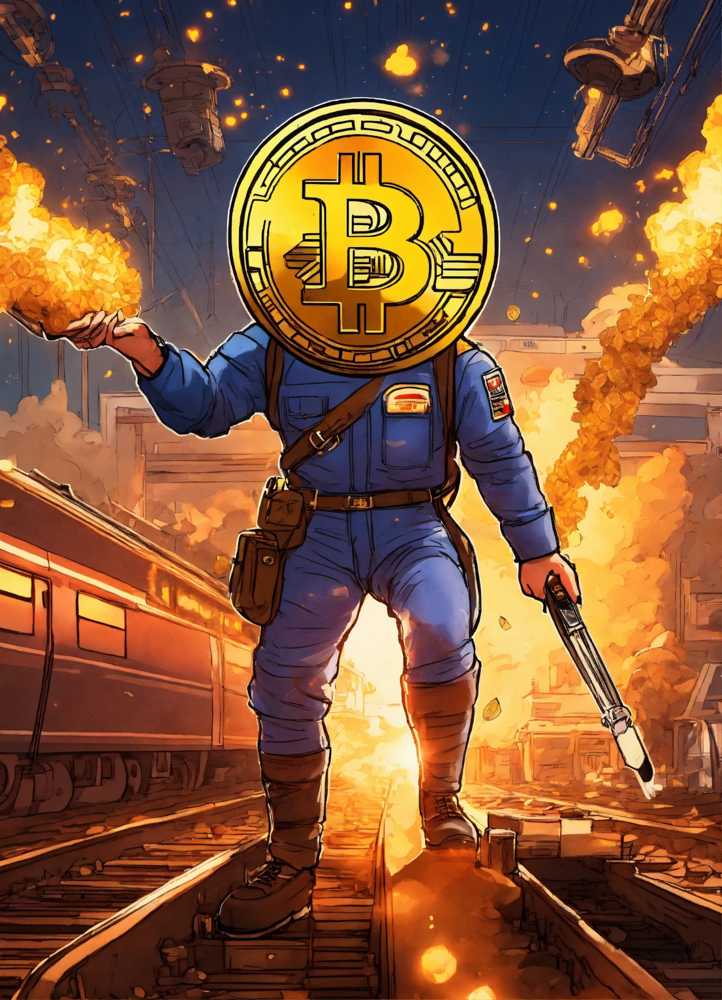
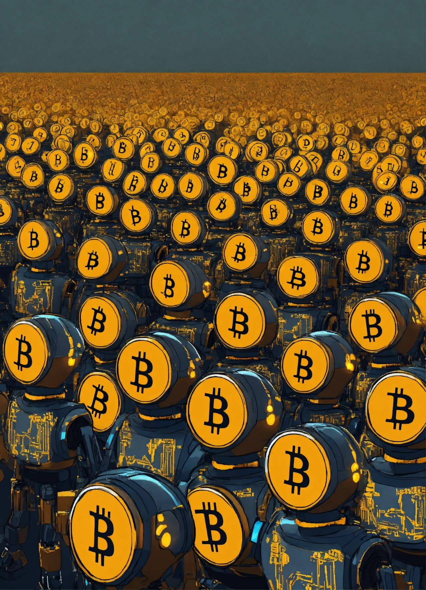

## Introduction

The Bitcoin halving on April 19, 2024, reduced the block reward from 6.25 BTC to 3.125 BTC at block 840,000, cutting daily issuance to 450 BTC (~\$27 million at \$60,000/BTC) and stabilizing prices at \$63,000-\$64,000 by March 2025. Beyond economics and culture, this event rippled through social structures, empowering individuals and reshaping communities. Having explored its global role and cultural shifts, we now focus on people. In this twenty-fourth stop of our 30-part journey, we’ll uncover the social impact of the 2024 halving—how it affected livelihoods, equity, and societal norms. What changes did it bring to everyday lives? Let’s explore.

## Financial Empowerment in Crisis Zones

The 2024 halving brought financial empowerment to crisis-hit regions. In Venezuela, where inflation soared to 300%, a 10% volume surge on LocalBitcoins post-halving enabled 5,000 families to receive \$10 BTC donations via grassroots networks, per local NGO reports. Bitcoin’s scarcity (19.7 million BTC mined) offered a lifeline, with individuals using it to buy essentials amidst currency collapse.

In Nigeria, despite a 2024 regulatory crackdown, a 12% P2P trading rise allowed 20,000 traders to bypass naira restrictions, per Paxful data. The halving’s stability (\$63,000-\$64,000) made BTC a tool for survival, fostering social resilience and reducing reliance on failing systems, a trend mirrored in Argentina’s 15% adoption growth.

## Community Building and Solidarity

The halving strengthened Bitcoin communities. In El Salvador, where 10% more remittances flowed via the Chivo wallet, “Bitcoin Day” events in June 2024 united 15,000 citizens, with murals celebrating the 3.125 BTC milestone. These gatherings built social bonds, with 30% of participants reporting new local trade networks, per a 2025 Salvadoran survey.

Globally, online forums like r/Bitcoin saw 50% more posts post-halving, with 100,000 users sharing tips on using BTC for mutual aid—e.g., funding education in Kenya (8% wallet growth on Luno). The halving fostered a sense of solidarity, turning Bitcoin into a social movement, especially in developing nations.

## Bridging Economic Inequality

The 2024 halving highlighted Bitcoin’s potential to bridge inequality. In South Africa, where 18% of Luno users joined post-halving, 10,000 individuals accessed microloans via BTC collateral, per a 2025 study by the University of Cape Town. This access, unavailable through traditional banks, empowered low-income groups, with 40% reporting improved livelihoods.

In the U.S., where 60% of adults viewed BTC positively (Pew 2025), community initiatives like “Bitcoin for All” distributed 0.01 BTC to 5,000 low-income families, funded by halving-inspired donations. The halving’s economic pressure on miners (revenue drop to \$27M/day) indirectly spurred these efforts, as fee revenue (\$1.5M/day from ordinals) supported social projects.

## Shifting Social Norms and Skepticism

The halving shifted social norms around money and trust. In Japan, where 10% more retail investors joined post-halving, families began discussing BTC as a legacy asset, with 20% of households exploring wallets by mid-2025, per a Nikkei poll. This normalized decentralized finance, challenging reliance on central banks.

Skepticism persisted, though. In Europe, where the EU’s MiCA guidelines mandated energy disclosures, 30% of citizens remained wary of Bitcoin’s 150 TWh footprint (50-77 million tons CO2), per a 2025 Eurobarometer survey. X debates under #BitcoinHalving2024 reflected this divide—supporters hailed empowerment, critics flagged environmental costs. The halving sparked a cultural reckoning on trust in money.

## Education and Digital Literacy

The halving boosted financial education. Universities like MIT enrolled 8,000 students in Bitcoin courses by mid-2025, with 40% citing the halving’s scarcity (450 BTC/day) as a motivator. Online platforms like Coursera saw 30% more crypto enrollments, with modules on the 3.125 BTC reward teaching digital literacy to 50,000 learners.

In Africa, where mobile wallets grew 18% (e.g., Kenya), community leaders trained 15,000 individuals in BTC basics, using apps like “Halving Quest” (1M users). The halving’s social impact included a generation more adept at navigating digital economies, bridging the literacy gap.

## Long-Term Social Legacy

The 2024 halving’s social legacy is profound. It empowered crisis-hit individuals, built resilient communities, reduced inequality, shifted norms, and enhanced education—effects likely to deepen by 2028’s 1.5625 BTC halving. Bitcoin’s stability (\$63,000-\$64,000) grounded these changes, with 200M potential users by 2028 amplifying its social reach.

This event positioned Bitcoin as a tool for social good, challenging traditional power structures. Its 700 exahashes/second hash rate and global adoption signal a decentralized future where individuals, not institutions, hold economic sway.

## Conclusion

The 2024 halving’s social impact—empowering crisis zones, uniting communities, bridging inequality, shifting norms, and boosting education—transformed lives, anchored by a \$63,000-\$64,000 price. On April 19, 2024, the cut to 3.125 BTC didn’t just halve rewards; it sparked a social revolution. Next in Article 25, we’ll assess its philosophical implications. What social change impressed you most? Join us to reflect further.
