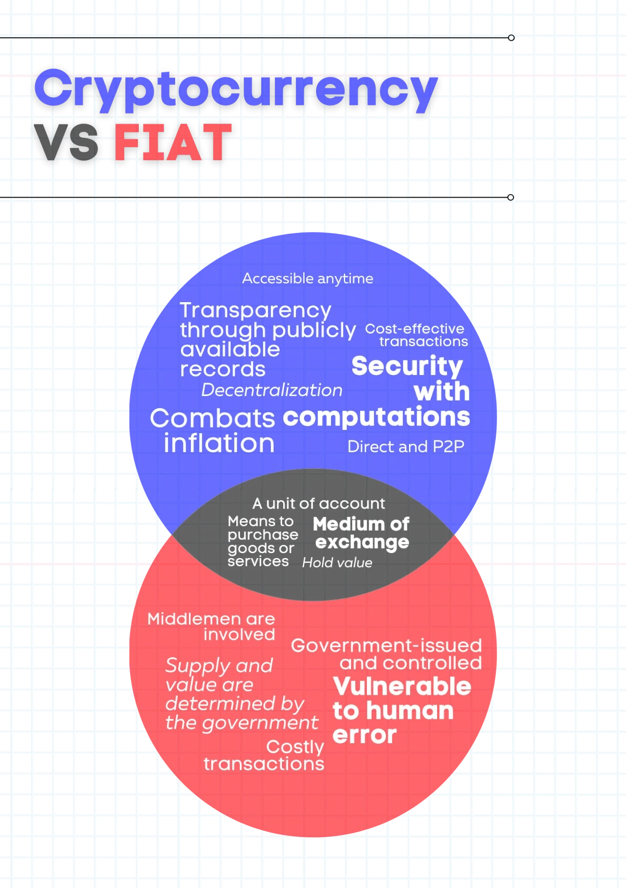
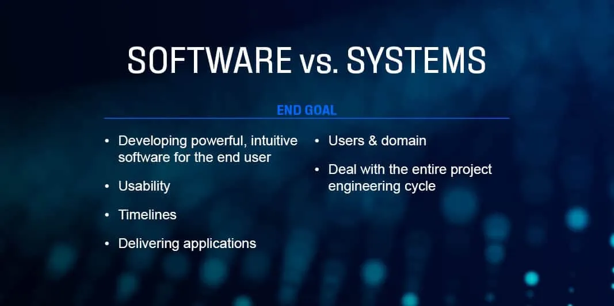
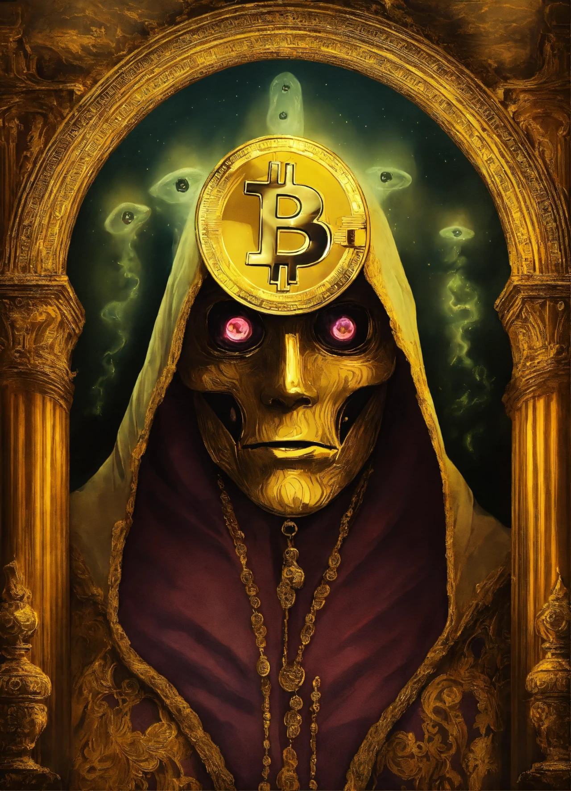

## Introduction

The Bitcoin halving on April 19, 2024, cut the block reward from 6.25 BTC to 3.125 BTC at block 840,000, reducing daily issuance to 450 BTC (~\$27 million at \$60,000/BTC) and stabilizing prices at \$63,000-\$64,000 by March 2025. Beyond its tangible effects—economic shifts, cultural waves, and social empowerment—this event raised profound philosophical questions about value, freedom, and trust. Having explored its practical impacts, we now turn to the abstract. In this twenty-fifth stop of our 30-part journey, we’ll delve into the philosophical implications of the 2024 halving, examining how it challenges our understanding of money, power, and society. What deeper truths does this milestone reveal? Let’s reflect.

## Redefining the Nature of Value

The 2024 halving, with its cut to 3.125 BTC per block, intensified Bitcoin’s scarcity narrative—19.7 million BTC of a 21 million cap were mined, leaving ~1.3 million to be issued over the next century. This scarcity, unlike fiat currencies prone to inflation (e.g., U.S. CPI at 3.5% in 2025), prompts a philosophical question: What gives money value?

Bitcoin’s value, stable at \$63,000-\$64,000, stems not from central authority but from decentralized consensus—15,000+ nodes and 700 exahashes/second securing the network. The halving challenges the notion that value must be state-backed, suggesting instead that collective belief and mathematical certainty (e.g., 10-minute block times) can define worth, a shift from traditional economics to a trustless, code-based system.

## Freedom and Decentralization

The halving underscored Bitcoin’s philosophical promise of freedom. In regions like Venezuela (300% CPI, 10% volume growth post-halving) and Nigeria (12% P2P surge), individuals used BTC to escape financial oppression, bypassing central banks. The 3.125 BTC reward symbolized a system where no single entity controls issuance, contrasting with fiat systems where governments print money at will.

This decentralization raises questions of autonomy. Does true financial freedom require escaping centralized power, as Satoshi Nakamoto envisioned? The halving’s empowerment—e.g., 5,000 Venezuelan families receiving \$10 BTC donations—suggests yes, but miner consolidation (20% small operators exiting) and regulatory oversight (EU’s MiCA rules) challenge this ideal, highlighting a tension between freedom and practical governance.

## Trust in Systems vs. Trust in Code

Bitcoin’s trustless design, reinforced by the 2024 halving, questions societal reliance on intermediaries. With fees at \$1.5M/day from ordinals and a \$1.2T market cap, Bitcoin operates without banks or governments—users trust its code (SHA-256 hashing, proof-of-work) over institutions. The halving’s stability (\$63,000-\$64,000) bolstered this trust, with 70% of BTC held long-term, per Glassnode.

Philosophically, this shift asks: Can code replace human trust? In El Salvador, where 10% more remittances used the Chivo wallet, BTC proved reliable, but skepticism persisted—30% of Europeans distrusted its 150 TWh footprint, per a 2025 Eurobarometer survey. The halving forces us to weigh trust in transparent algorithms against trust in flawed human systems.

## Power Dynamics and Social Equity

The halving illuminated power dynamics. Bitcoin’s 700 exahashes/second hash rate, largely controlled by giants like Marathon (28.7 trillion hashes/second), raised concerns of centralization within decentralization—85% of hash rate in large pools by 2025. Yet, its social impact—empowering 20,000 Nigerian traders, bridging inequality via 10,000 South African microloans—suggests a redistribution of economic power to the marginalized.

Philosophically, this duality questions equity. Does Bitcoin democratize power by giving individuals control (e.g., 200M users by 2028), or does it create new elites (miners, ETF holders)? The halving’s legacy—empowerment in crisis zones, but consolidation among miners—suggests both, challenging us to rethink fairness in a decentralized world.

## The Ethics of Scarcity and Sustainability

The halving’s scarcity (450 BTC/day) and environmental footprint (150 TWh, 35% renewable) raise ethical questions. Philosophers debate: Is engineered scarcity ethical when it drives value (\$63,000-\$64,000) but excludes late adopters? In Argentina (15% adoption growth), BTC countered inflation, but high entry costs deterred the poorest.

Sustainability adds another layer. Bitcoin’s 50-77 million tons of CO2 emissions, despite green strides (e.g., Riot’s 70% renewable use), prompt ethical scrutiny—does the pursuit of freedom justify environmental costs? The halving’s push for renewables (e.g., carbon capture offsetting 10,000 tons) offers hope, but the tension between individual liberty and collective responsibility persists.

## A New Philosophical Framework

The 2024 halving birthed a new philosophical lens—Bitcoin as a mirror for human values. Its \$1.2T market cap and global reach (e.g., South Korea’s 20% ordinal user growth) challenge notions of value, freedom, trust, power, and ethics. By 2028’s 1.5625 BTC halving, these questions will deepen, as Bitcoin’s 200M users and tech leaps (e.g., Lightning at 150K TPS) amplify its societal role.
This event invites us to rethink money’s purpose—is it a tool for control or liberation? The halving’s stability and adoption suggest the latter, but its challenges (centralization, emissions) demand ongoing reflection.

## Conclusion

The 2024 halving, cutting rewards to 3.125 BTC, sparked philosophical debates on value, freedom, trust, power, and ethics, grounded by a \$63,000-\$64,000 price and global impact. On April 19, 2024, Bitcoin became more than a currency—it became a lens for examining human systems. Next in Article 26, we’ll explore its political implications. What philosophical question resonates with you? Join us to ponder further.
