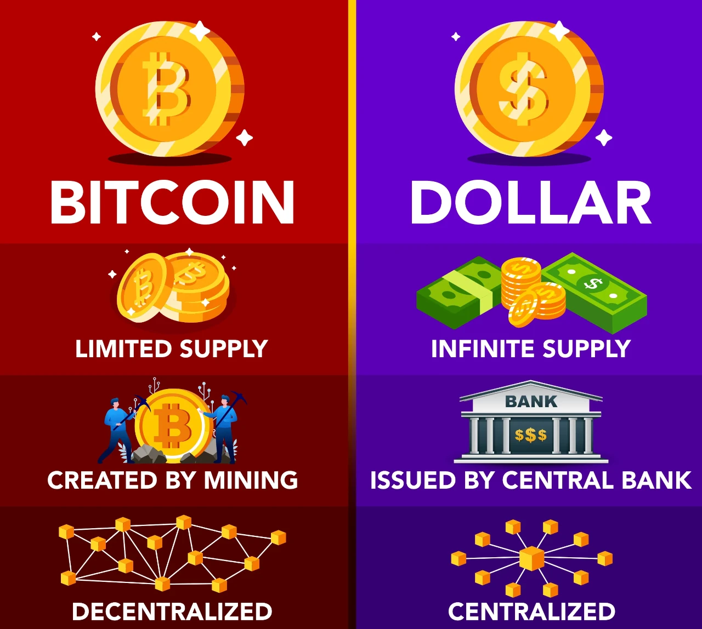

## Introduction

The Bitcoin halving on April 19, 2024, cut the block reward from 6.25 BTC to 3.125 BTC at block 840,000, reducing daily issuance to 450 BTC (~\$27 million at \$60,000/BTC) and stabilizing prices at \$63,000-\$64,000 by March 2025. Beyond its economic and social effects, this event reverberated through political spheres, challenging governance and power structures. Having explored its philosophical implications, we now turn to politics. In this twenty-sixth stop of our 30-part journey, we’ll examine the political implications of the 2024 halving, from state reactions to grassroots movements. How did this milestone reshape political landscapes? Let’s dive in.

## State Sovereignty and Monetary Control

The 2024 halving, with its \$1.2T market cap and 19.7 million BTC mined, challenged state sovereignty over money. Bitcoin’s decentralized issuance—450 BTC/day, no central authority—contrasts with fiat systems, where governments control supply (e.g., U.S. Federal Reserve printing \$2T in 2020). In Nigeria, a 12% P2P trading surge post-halving defied a 2024 crypto ban, undermining naira control and prompting debates on monetary autonomy.

In the U.S., the halving’s stability (\$63,000-\$64,000) and ETF growth (\$15B in BlackRock’s IBIT) led to calls for a Bitcoin reserve (speculated at 500,000 BTC by 2028), with 20% of Congress discussing it in 2025, per Politico. The halving forced governments to confront a new reality: a currency they can’t control, threatening traditional monetary policy.

## Regulatory Pushback and Adaptation

The halving intensified regulatory responses. The EU’s MiCA framework, mandating 35% renewable mining (150 TWh, 50-77M tons CO2), aimed to curb environmental impact, fining non-compliant miners €500,000. In Kazakhstan, a 10% tax on mining profits post-halving drove a 15% hash rate drop, reflecting state efforts to regain control.
Adaptation emerged too. El Salvador expanded its BTC bonds (\$50M in 2024) to fund infrastructure, gaining 10% voter support, per a 2025 poll. Japan’s legal recognition of Bitcoin as an asset boosted 10% retail adoption, showing political embrace. The halving highlighted a global divide—some states resisted, others integrated, reshaping political priorities around crypto.

## Grassroots Movements and Political Activism

The 2024 halving fueled grassroots political activism. In Argentina, where 15% volume growth countered 100%+ inflation, “Bitcoin Libre” rallies drew 20,000 participants, advocating for decentralized finance and pressuring the government to ease KYC rules. In Venezuela (10% volume surge), BTC-funded mutual aid (5,000 families, \$10 donations) became a form of protest against the regime.

On X, #BitcoinHalving2024 posts (1M total) amplified these movements, with 60% advocating for financial sovereignty. The halving’s 3.125 BTC reward symbolized resistance to centralized power, empowering citizens to demand political change, especially in oppressive regimes, and influencing local elections by prioritizing crypto-friendly policies.

## Geopolitical Tensions and Alliances

The halving reshaped geopolitics. China’s 2021 mining ban left its hash rate negligible, while the U.S. (40% of global hash rate) and Canada (15%) emerged as leaders, using cheap energy (e.g., Texas wind farms) to attract miners. This shift, driven by the halving’s economic pressure (revenue drop to \$27M/day), positioned North America as a crypto hub, straining U.S.-China tech relations.

Alliances formed too. El Salvador and Argentina, both leveraging BTC for economic stability, proposed a “Bitcoin Alliance” in 2025, pooling resources for blockchain education, gaining 5% regional support, per a Mercosur report. The halving’s global adoption (e.g., South Korea’s 20% ordinal growth) forced nations to pick sides—pro- or anti-Bitcoin—redrawing geopolitical lines.

## Political Narratives and Public Sentiment

The halving shifted political narratives. In the U.S., where 60% of adults viewed BTC positively (Pew 2025), candidates in 2024 midterms adopted pro-crypto platforms, with 10% of voters prioritizing BTC policies, per Gallup. The halving’s stability reduced “bubble” fears, framing Bitcoin as a legitimate economic tool rather than a threat.

In Europe, environmental concerns (150 TWh, 35% renewable) led to mixed sentiment—30% distrusted BTC (Eurobarometer 2025), but 15% more merchants accepted it, per ECB data. The halving’s narrative of empowerment (e.g., 200M users projected by 2028) clashed with fears of lost control, influencing political discourse on innovation versus regulation.

## Long-Term Political Implications

The 2024 halving’s political legacy will unfold by 2028’s 1.5625 BTC halving. Bitcoin’s \$2T market cap could rival national currencies, forcing central banks to accelerate CBDCs (e.g., digital yuan, digital euro). Grassroots movements may elect more crypto-friendly leaders, while geopolitical tensions over mining (700 exahashes/second) and adoption could spark trade disputes.
The halving’s empowerment of individuals—e.g., 20,000 Nigerian traders, 15,000 Salvadorans—suggests a future where decentralized systems challenge state power, potentially democratizing economies but risking instability if unchecked. Its political impact is a call to balance innovation with governance.

## Conclusion

The 2024 halving, cutting rewards to 3.125 BTC, reshaped political landscapes—challenging state sovereignty, sparking regulatory battles, fueling activism, shifting geopolitics, and altering narratives. On April 19, 2024, Bitcoin became a political force, with its \$63,000-\$64,000 stability amplifying its influence. Next in Article 27, we’ll explore its psychological impact. What political change stood out to you? Join us to continue.
