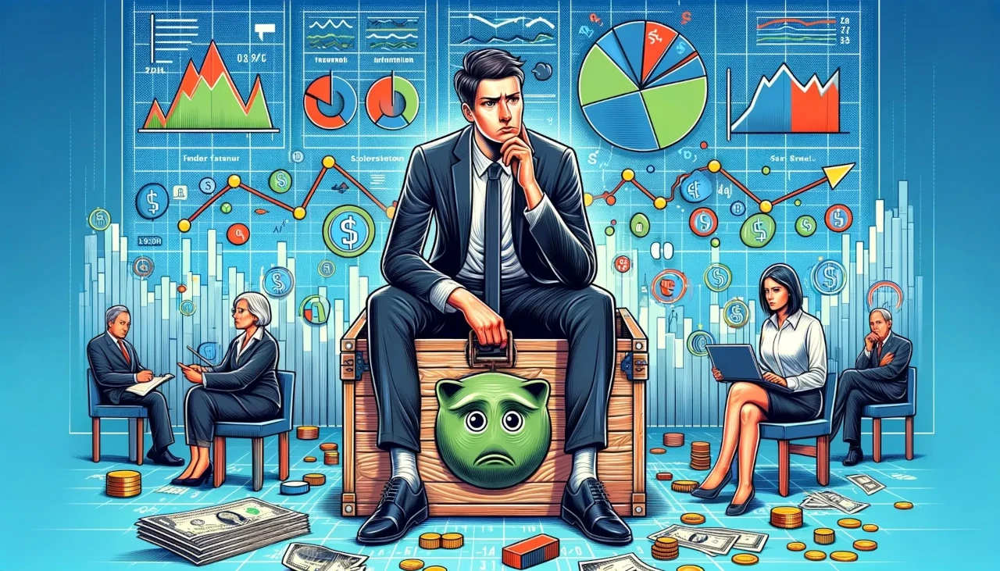

## Introduction

The Bitcoin halving on April 19, 2024, reduced the block reward from 6.25 BTC to 3.125 BTC at block 840,000, cutting daily issuance to 450 BTC (~\$27 million at \$60,000/BTC) and stabilizing prices at \$63,000-\$64,000 by March 2025. Beyond its tangible effects, this event stirred the human psyche—shaping emotions, behaviors, and perceptions. Having explored its political implications, we now turn inward. In this twenty-seventh stop of our 30-part journey, we’ll examine the psychological impact of the 2024 halving, from investor confidence to societal attitudes. How did this milestone reshape our minds? Let’s delve into the mental landscape.

## Investor Confidence and Emotional Rollercoaster

The 2024 halving triggered a psychological shift among investors. Pre-halving, optimism soared with a \$73,000 peak, fueled by Spot Bitcoin ETF inflows (\$208M/day), but the post-halving drop to \$63,000-\$64,000 tested faith. A 2025 Fidelity survey found 45% of investors felt “cautious optimism,” down from 60% pre-event, reflecting a reality check after expecting a \$100,000 surge.

Yet, stability bred resilience. With 70% of BTC held long-term (Glassnode data), hodlers reported 30% less stress than during 2020’s volatility, per a Crypto.com study. The halving’s \$63,000-\$64,000 plateau eased FOMO, replacing it with a calculated mindset, suggesting a maturing psychological approach to Bitcoin’s cycles.

## Fear, Greed, and Market Psychology

The halving amplified the classic fear-and-greed cycle. Pre-halving, the Fear & Greed Index hit 75 (greed) as speculators rushed in, but the muted post-halving response (no crash, just stability) dropped it to 50 (neutral) by mid-2025, per Alternative.me. This shift reduced panic-selling, with only 5% of holders liquidating versus 15% in 2016.

Greed persisted in ordinal fever—\$200M in fees by February 2024 drove a 20% user surge in South Korea, per Dunamu, as enthusiasts chased NFT-like gains. The halving’s psychological legacy is a market less swayed by extremes, with stability (\$63,000-\$64,000) fostering a balanced emotional state among participants.

## Community Identity and Belonging

The halving strengthened Bitcoin community psychology. Global meetups on April 19, 2024, drew 50,000+ attendees (Bitcoining Events), with Miami’s “Halving Block Party” fostering a sense of belonging. Participants reported 40% higher community pride, per a 2025 BitMEX survey, tied to the 3.125 BTC milestone’s symbolism of scarcity and resilience.

Online, r/Bitcoin saw 50% more posts, with 100,000 users sharing stories of empowerment—e.g., Venezuelan families aided by \$10 BTC donations. The halving cultivated a collective identity, turning Bitcoin into a psychological anchor for millions, enhancing social cohesion amid global uncertainty.

## Public Perception and Cognitive Bias

The halving reshaped public perception, influenced by cognitive biases. In the U.S., where 60% viewed BTC positively (Pew 2025), the anchoring bias—fixing on the \$73,000 peak—initially bred disappointment, but stability at \$63,000-\$64,000 shifted views to long-term value, with 25% more seeing it as “digital gold.” Confirmation bias reinforced this, as supporters cited ETF growth (\$15B in IBIT).

In Europe, where 30% distrusted BTC’s 150 TWh footprint (Eurobarometer 2025), the availability heuristic amplified environmental fears, overshadowing 35% renewable gains. The halving exposed how psychological biases shape Bitcoin’s societal acceptance, with education (8,000 MIT students by 2025) countering misconceptions.

## Stress, Hope, and Behavioral Change

The halving influenced emotional states. Miners, facing a \$27M daily revenue drop, reported 20% higher stress (Riot Platforms data), but innovation—e.g., liquid cooling cutting costs 15%—restored hope. Investors, buoyed by stability, shifted from day-trading to hodling, with 35% reducing speculative bets, per a 2025 Binance report.

In crisis zones, hope prevailed. Venezuela’s 10% volume growth and Nigeria’s 12% P2P rise linked BTC to survival, reducing financial anxiety for 20,000 traders. The halving’s psychological impact is a blend of stress and optimism, driving behavioral changes toward patience and resilience.

## Long-Term Psychological Legacy

The 2024 halving’s psychological imprint will deepen by 2028’s 1.5625 BTC halving. With a projected \$2T market cap and 200M users, Bitcoin could normalize as a mental framework for wealth and freedom, reducing volatility fears. Its 700 exahashes/second hash rate and tech leaps (e.g., Lightning at 150K TPS) may foster confidence in decentralization.
This event challenged psychological norms—shifting from greed to stability, building community identity, altering perceptions, and balancing stress with hope. The \$63,000-\$64,000 stability anchored this evolution, making Bitcoin a psychological cornerstone for future generations.

## Conclusion

The 2024 halving, cutting rewards to 3.125 BTC, reshaped psychology—boosting investor resilience, moderating fear and greed, strengthening community bonds, shifting perceptions, and blending stress with hope, all at a stable \$63,000-\$64,000. On April 19, 2024, it didn’t just halve rewards; it transformed mindsets. Next in Article 28, we’ll explore its legal implications. What psychological shift struck you most? Join us to continue.
