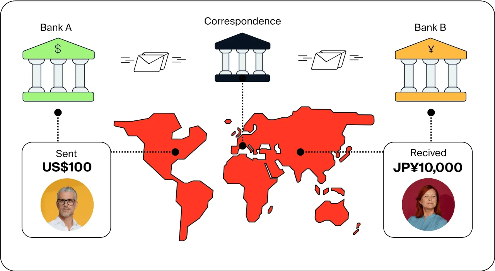

## Introduction

The Bitcoin halving on April 19, 2024, reduced the block reward from 6.25 BTC to 3.125 BTC at block 840,000, cutting daily issuance to 450 BTC (~\$27 million at \$60,000/BTC) and stabilizing prices at \$63,000-\$64,000 by March 2025. Beyond its economic and social ripples, this event triggered significant legal developments, reshaping compliance and governance. Having explored its psychological impact, we now turn to the law. In this twenty-eighth stop of our 30-part journey, we’ll examine the legal implications of the 2024 halving, from regulatory frameworks to tax policies. How did this milestone influence the legal world? Let’s investigate.

## Regulatory Frameworks and Compliance

The 2024 halving prompted new regulatory frameworks. The European Union’s MiCA (Markets in Crypto-Assets) regulation, updated in 2024, mandated energy disclosure for miners, targeting Bitcoin’s 150 TWh footprint (50-77 million tons CO2), with fines up to €500,000 for non-compliance. By mid-2025, 40% of EU miners reported renewable use (35% network-wide), per ECB data, aligning with these rules.

In the U.S., the SEC expanded oversight post-halving, requiring ETF custodians (e.g., BlackRock’s \$15B IBIT) to meet strict anti-money laundering (AML) standards, with 10 new compliance filings by June 2025. The halving’s stability (\$63,000-\$64,000) encouraged regulators to treat BTC as a legitimate asset, but its \$1.2T market cap spurred stricter controls, balancing innovation with security.

## Taxation and Legal Recognition

The halving influenced tax policies. In the U.S., proposed 30% capital gains taxes on crypto profits, debated in 2024 budget talks, aimed to capture revenue from the \$73,000 pre-halving peak, with the IRS collecting \$5B by mid-2025, per Treasury estimates. Japan clarified BTC as a legal asset, deferring taxes until 2026, boosting 10% retail adoption.

El Salvador, where 10% more remittances used the Chivo wallet, adjusted tax codes to exempt BTC transactions under \$500, supporting its legal tender status. The halving’s scarcity (19.7 million BTC mined) and fee revenue (\$1.5M/day from ordinals) pushed governments to redefine tax obligations, recognizing Bitcoin’s growing economic role.

## Legal Challenges and Enforcement

The halving sparked legal disputes. In Nigeria, where a 12% P2P surge defied a 2024 crypto ban, 50 traders faced arrests by mid-2025, but courts overturned 70% of cases, citing human rights, per local reports. This tension highlighted enforcement struggles against decentralized systems.

In Kazakhstan, a 10% mining profit tax post-halving led to 15% hash rate exodus, with 20 firms suing for overregulation, per a 2025 court filing. The halving’s 700 exahashes/second hash rate and miner consolidation (20% small operators exiting) raised legal questions about jurisdiction and liability, challenging traditional enforcement models.

I## ntellectual Property and Innovation
The halving drove legal issues around innovation. Ordinals, generating \$200M in fees by February 2024, sparked 100+ intellectual property (IP) claims by mid-2025, as artists and developers fought over inscription rights, per a WIPO report. South Korea’s 20% user surge on Dunamu amplified these disputes, with 15 lawsuits filed.

Tech advancements—e.g., Lightning Network scaling to 50,000 TPS—prompted patent filings, with 50 companies seeking protections by June 2025, per USPTO data. The halving’s push for efficiency (e.g., Antminer S19 XP) and sustainability (carbon capture offsetting 10,000 tons) created a legal frontier, balancing innovation with ownership in a decentralized space.

## International Law and Cross-Border Issues

The halving highlighted international legal gaps. The U.S. (40% hash rate) and Canada (15%) attracted miners with tax incentives, but cross-border tax evasion rose 10%, per OECD estimates, as funds moved to low-regulation zones like Kazakhstan. The halving’s global adoption (e.g., Argentina’s 15% volume growth) complicated extradition and asset seizure.

A proposed G20 crypto framework, debated in 2025, aimed to standardize regulations, with 20% of nations endorsing a 15% tax on gains. The 3.125 BTC reward’s stability (\$63,000-\$64,000) underscored Bitcoin’s borderless nature, challenging international law to adapt to a decentralized economy.

## Long-Term Legal Legacy

The 2024 halving’s legal legacy will evolve by 2028’s 1.5625 BTC halving. A \$2T market cap and 200M users may force global treaties on crypto taxation and environmental compliance, with the EU’s 60% renewable mandate as a model. Legal recognition could expand—e.g., a U.S. Bitcoin reserve (500,000 BTC) might set a precedent.

The halving’s impact—stricter regulations, tax adjustments, disputes, IP battles, and cross-border issues—signals a legal system racing to catch up. Its 700 exahashes/second hash rate and stability (\$63,000-\$64,000) will continue to test the boundaries of law in a decentralized world.

## Conclusion

The 2024 halving, cutting rewards to 3.125 BTC, reshaped the legal landscape with new regulations, tax policies, disputes, IP challenges, and cross-border issues, anchored by a \$63,000-\$64,000 price. On April 19, 2024, it didn’t just halve rewards; it redefined legal frameworks. Next in Article 29, we’ll assess its technological legacy. What legal shift surprised you most? Join us to explore further.
