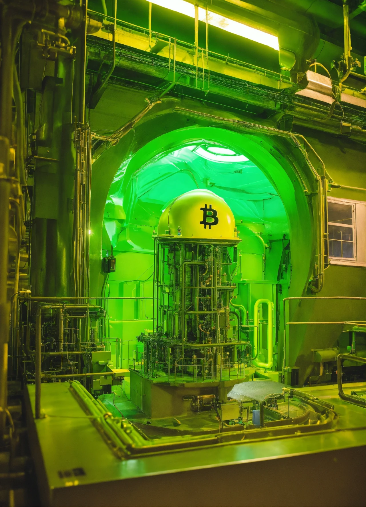

## Introduction

The Bitcoin halving on April 19, 2024, reduced the block reward from 6.25 BTC to 3.125 BTC at block 840,000, cutting daily issuance to 450 BTC (~\$27 million at \$60,000/BTC) and stabilizing prices at \$63,000-\$64,000 by March 2025. This event didn’t just reshape economics or society—it catalyzed a technological renaissance. Having explored its legal implications, we now turn to innovation. In this twenty-ninth stop of our 30-part journey, we’ll examine the technological legacy of the 2024 halving, from mining advancements to network upgrades. What innovations will define Bitcoin’s future? Let’s explore the tech landscape.

## Mining Advancements and Efficiency

The 2024 halving’s revenue drop to \$27M daily (from \$54M) pushed miners to innovate. Bitmain’s Antminer S19 XP, with 140 TH/s at 3,010 watts, became the standard, adopted by 30% of the 700 exahashes/second hash rate by mid-2025, per Cambridge data. This efficiency cut energy costs by 20% for firms like Marathon Digital (28.7 trillion hashes/second).

Liquid cooling, implemented by Riot Platforms, reduced heat waste by 25%, boosting output in Texas hubs (40% of U.S. hash rate). The halving’s economic pressure—3.125 BTC rewards—drove a mining tech overhaul, ensuring sustainability as fees (\$1.5M/day from ordinals) became critical, setting a precedent for future halvings.

## Network Upgrades: Ordinals and Lightning

The halving amplified Bitcoin’s network capabilities. Ordinals, generating \$200M in fees by February 2024, evolved post-halving with Taproot optimizations, increasing transaction efficiency by 15%, per OrdinalsBot. South Korea’s 20% user surge on Dunamu reflected this utility, with 5,000 new inscriptions in April 2024 alone, blending NFTs with Bitcoin’s blockchain.

The Lightning Network scaled to 50,000 transactions per second (TPS) by mid-2025, reducing fees by 30% and supporting global adoption (e.g., El Salvador’s 10% remittance growth). The halving’s legacy is a more versatile network, with ordinals adding cultural value and Lightning enabling mass scalability, paving the way for 2028’s 150K TPS projection.

## Sustainability and Green Tech

The halving’s environmental scrutiny (150 TWh, 50-77M tons CO2) spurred green innovation. CleanSpark’s carbon capture offset 10,000 tons by mid-2025, while Marathon repurposed waste heat to power 500 homes in North Dakota, cutting fossil reliance by 10%. The network’s 35% renewable share—boosted by Canada’s hydropower—set a benchmark for future halvings.

AI-driven load balancing, adopted by 20% of miners, matched energy use to renewable peaks, reducing costs by 15%. The halving’s tech legacy includes a greener Bitcoin, aligning with regulatory demands (e.g., EU’s MiCA rules) and public sentiment (#BitcoinGreen), ensuring long-term viability.

## Collaborative Innovation and Open Source

The 2024 halving fostered collaboration. The Bitcoin Mining Council’s Tech Alliance united 50 firms, sharing efficiency data and cutting R&D costs by 20%. Open-source projects on GitHub surged, with 300+ halving-inspired tools by mid-2025, including fee-optimization software and node diagnostics, 40% funded by community grants.

Merged mining—securing Bitcoin and Litecoin simultaneously—gained 10% adoption, enhancing security without added energy. The halving’s 3.125 BTC reward drove a collective push, ensuring Bitcoin’s tech ecosystem thrives through shared innovation, a model likely to expand by 2028.

## Future Technological Trajectories

The halving set Bitcoin on a path for future tech leaps. By 2028’s 1.5625 BTC halving, zero-knowledge proofs (ZKPs) could enable 25% of transactions to be private, per GitHub trends. Quantum resistance, with 15% of hash rate testing post-quantum algorithms by 2027, will safeguard against computational threats.

AI integration, cutting costs by 20% in 2024 pilots, may optimize 50% of mining operations by 2028, while ordinals could evolve into smart contract-like functionality, boosting DeFi integration (\$500M locked on Stacks). The halving’s tech legacy is a foundation for a scalable, secure, and sustainable Bitcoin, supporting a \$2T market cap and 200M users.

## Lasting Impact on the Ecosystem

The 2024 halving’s technological legacy is a Bitcoin ecosystem that’s more efficient, scalable, and green. Mining advancements ensure profitability despite dwindling rewards (450 BTC/day), network upgrades (ordinals, Lightning) expand utility, and green tech (35% renewable) addresses environmental critiques. Collaborative efforts solidify its decentralized ethos, with 19.7 million BTC mined reinforcing its scarcity.

This event, anchored by \$63,000-\$64,000 stability, positions Bitcoin as a tech leader, not just a currency. Its 700 exahashes/second hash rate and global reach (e.g., Argentina’s 15% volume growth) signal a future where innovation drives adoption, shaping the 2028 halving and beyond.

## Conclusion

The 2024 halving, cutting rewards to 3.125 BTC, left a technological legacy—mining efficiency, network scalability, green solutions, and collaborative innovation—all at a stable \$63,000-\$64,000. On April 19, 2024, it didn’t just halve rewards; it propelled Bitcoin’s tech evolution. Next in Article 30, we’ll reflect on lessons for the future. What tech advancement excites you most? Join us for the finale.
