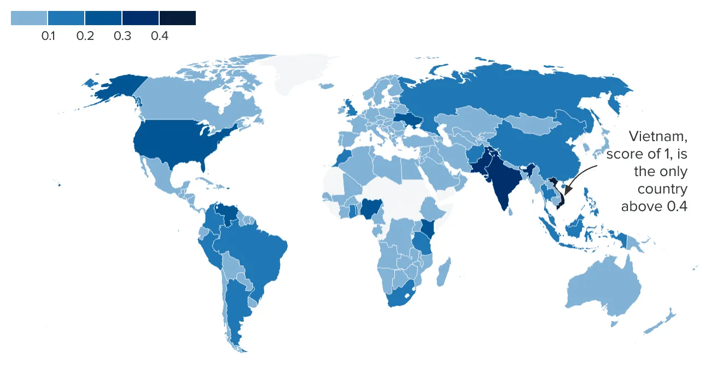
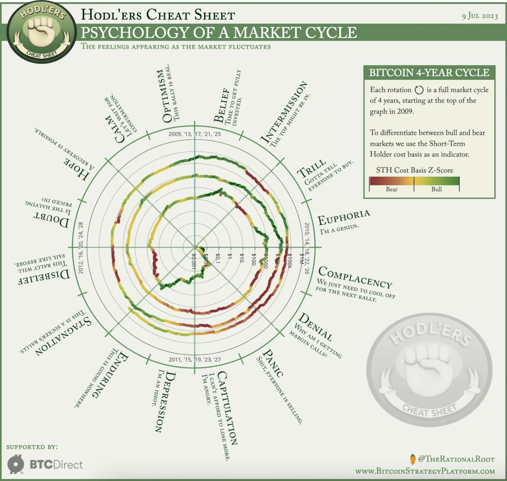

## Introduction

The Bitcoin halving on April 19, 2024, cut the block reward from 6.25 BTC to 3.125 BTC at block 840,000, reducing daily issuance to 450 BTC (~\$27 million at \$60,000/BTC) and stabilizing prices at \$63,000-\$64,000 by March 2025. Over 29 articles, we’ve explored its profound impacts—economic shifts, cultural waves, social empowerment, philosophical questions, political tensions, psychological effects, legal frameworks, and technological leaps. As we conclude our 30-part journey, this final article synthesizes the key lessons from the 2024 halving, offering insights for the future, especially the 2028 halving (1.5625 BTC). What can we learn from this milestone? Let’s reflect and look ahead.

## Lesson 1: Stability Signals Maturity

The 2024 halving taught us that Bitcoin is maturing. Unlike past cycles—2012’s \$1,000 surge, 2016’s \$19,000 peak, 2020’s \$69,000 climb—the \$73,000 pre-halving peak and \$63,000-\$64,000 post-halving stability showed a market less driven by hype. With a \$1.2T market cap and 70% of BTC held long-term (Glassnode), the halving highlighted a shift toward fundamentals—ETF inflows (\$15B in BlackRock’s IBIT) and fee revenue (\$1.5M/day from ordinals).

For 2028, this suggests a \$2T market cap and \$220,000-\$280,000 price potential, but with longer cycles (18-24 months), per Article 21. The lesson: future halvings will prioritize stability over speculation, requiring patience from investors and hodlers.

## Lesson 2: Resilience Through Innovation

The halving underscored resilience through innovation. Miners, facing a \$27M daily revenue drop, adopted next-gen tech—Antminer S19 XP (140 TH/s), liquid cooling (25% heat reduction)—and leaned on fees, ensuring a 700 exahashes/second hash rate. Ordinals (\$200M in fees) and Lightning Network scaling (50,000 TPS) expanded utility, while green tech (35% renewable, 10,000 tons CO2 offset) addressed environmental concerns.

By 2028, with rewards at 1.5625 BTC, fees may hit \$8M-\$12M daily, and 85% renewable adoption could cut emissions to 20-30M tons. The lesson: economic pressures will drive technological and sustainable solutions, ensuring Bitcoin’s longevity as rewards near zero by 2140.

## Lesson 3: Global Adoption Requires Balance

The 2024 halving boosted global adoption—Argentina’s 15% volume surge, El Salvador’s 10% remittance growth, South Korea’s 20% ordinal users—but revealed challenges. Regulatory pushback (Nigeria’s ban, EU’s MiCA rules) and centralization risks (85% hash rate in large pools) highlighted the need for balance. Empowerment in crisis zones (e.g., 20,000 Nigerian traders) clashed with environmental critiques (150 TWh, 50-77M tons CO2).

For 2028, with 200M users projected, adoption must balance inclusivity with sustainability and decentralization. The lesson: Bitcoin’s global role (e.g., 19.7M BTC mined) depends on navigating regulatory, environmental, and equity tensions, fostering broader acceptance.

## Lesson 4: Cultural and Social Shifts Are Lasting

The halving’s cultural and social impacts—community meetups (50,000 attendees), art via ordinals (5,000 inscriptions), empowerment in Venezuela (5,000 families aided)—showed Bitcoin as a movement. Education boomed (8,000 MIT students), and social equity improved (10,000 South African microloans), reshaping norms around money and trust.

By 2028, Bitcoin could inspire global festivals and financial literacy for 200M users. The lesson: future halvings will deepen Bitcoin’s role as a cultural and social force, uniting communities and empowering the marginalized, but must address skepticism (e.g., 30% EU distrust) through transparency.

## Lesson 5: Philosophical and Political Questions Persist

The 2024 halving raised enduring questions. Philosophically, it redefined value (code-based, not state-backed), freedom (decentralized control), and trust (code over institutions). Politically, it challenged sovereignty (Nigeria’s 12% P2P defiance), shifted geopolitics (U.S./Canada as mining hubs), and sparked activism (Argentina’s 20,000-strong rallies).

For 2028, these debates will intensify with a \$2T market cap and G20 tax frameworks. The lesson: future halvings must grapple with Bitcoin’s role in power dynamics, balancing individual liberty with collective governance, as its 700 exahashes/second hash rate grows.

## Lesson 6: Psychological and Legal Evolution

Psychologically, the halving taught resilience—investors shifted from greed (Fear & Greed Index 75) to stability (50), with 35% reducing speculative bets (Binance 2025). Legally, it spurred frameworks—EU’s energy rules, U.S. tax hikes (\$5B collected), and IP disputes (100+ ordinal claims)—forcing the law to adapt to a decentralized reality.

By 2028, with 200M users, psychological maturity will reduce volatility fears, while legal systems may standardize global taxes (15% gains). The lesson: future halvings will require emotional adaptability and legal clarity, ensuring Bitcoin’s integration into mainstream systems.

A Roadmap for the Future
The 2024 halving’s lessons—stability, innovation, balanced adoption, cultural shifts, philosophical depth, and psychological/legal growth—offer a roadmap. For 2028’s 1.5625 BTC halving, Bitcoin must sustain tech advancements (e.g., ZKPs, 150K TPS), prioritize sustainability (85% renewables), and foster inclusivity while addressing centralization. Its \$63,000-\$64,000 stability and 19.7M BTC mined set a foundation for a \$2T market cap and global acceptance, but challenges like regulation and emissions remain.

This milestone reminds us: Bitcoin is more than a currency—it’s a system reshaping value, society, and governance. Its future depends on learning from 2024’s blueprint.

## Conclusion

The 2024 halving, cutting rewards to 3.125 BTC, taught us stability, resilience, balance, cultural depth, philosophical inquiry, and psychological/legal growth, anchoring Bitcoin at \$63,000-\$64,000. On April 19, 2024, it didn’t just halve rewards—it laid a foundation for 2028 and beyond. As we close this series, what lesson resonates most? Thank you for joining this journey—let’s keep exploring Bitcoin’s future together.
